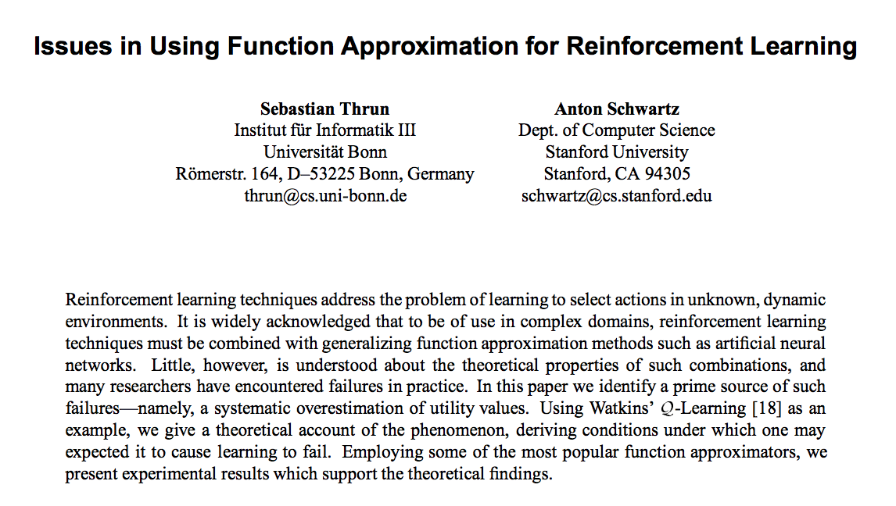
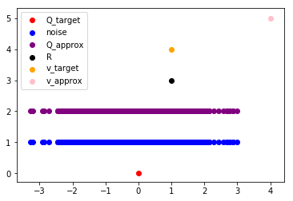
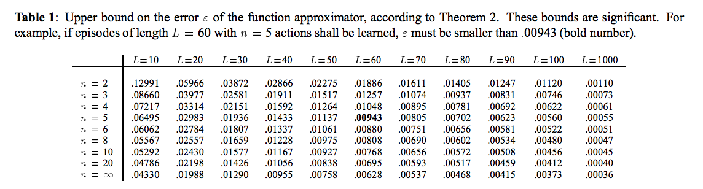
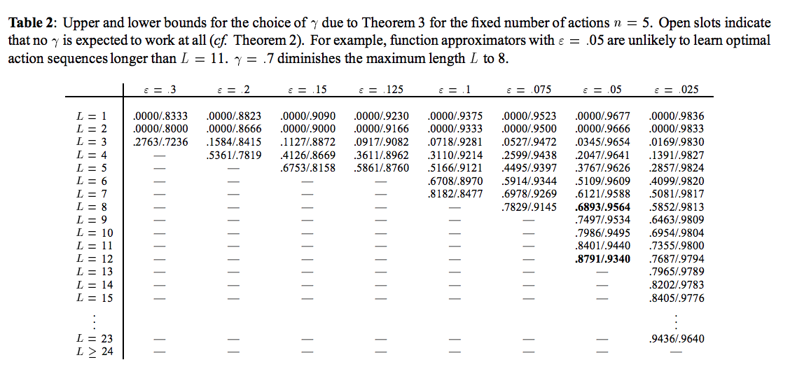

지난번 포스팅 <a href="https://jsideas.net/drlnd_review_1/">Review: Introduction to Deep Reinforcement Learning</a>에서 강화학습의 기초에 대해 알아보고, Cliff Walking이라는 간단한 그리드월드 문제를 Q Learning 등을 사용해 풀어봤다.

*Cliff Walking Problem with Q Learning*

Cliff Walking 문제는 state와 action의 가짓수가 한정된 discrete problem이었다. 이 문제를 풀기 위해 state x action 크기의 Q 테이블(action-value fucntion)을 만든 후, Q Learning 등을 사용해 테이블의 값을 채워나갔다. 학습이 완료된 후 각 state별로 최대 value를 가지는 action을 선택한 것이 위 그림과 같은 optimal policy다.

state와 action이 연속적인 값을 가지는 경우에도 Q테이블을 채워가는 방법을 사용할 수 있을까?

 

## Function Approximation for More Complex Tasks

우리가 일반적으로 RL을 통해 풀고자 하는 문제는 Cliff Walking보다 훨씬 더 복잡하고 어려운 문제다. Continous한 state를 가지는 경우에는 Q테이블을 만들 수 없을 뿐더러, discrete한 문제라 하더라도 바둑처럼 경우의 수가 너무 많아지면 모든 수를 샅샅히 분석하기란 현실적으로 불가능해진다. 

RL에서는 이런 복잡한 문제를 풀기 위해 function approximation을 사용한다. True optimal action-value function을 구할 수는 없지만 표현력이 좋은 모델을 사용해 이를 적절히 근사하는 방법이다. 여기서 Neural Network가 등장한다.

 

## Issues in Using Function Approximation for Reinforcement Learning

RL에 NN을 접목하려는 시도는 오래전부터 있어왔지만 그 기대만큼 문제가 쉽게 풀리지는 않았다. 그 이유를 다룬 논문 중 하나가 1993년에 발표된 <a href="https://www.ri.cmu.edu/pub_files/pub1/thrun_sebastian_1993_1/thrun_sebastian_1993_1.pdf">Issues in Using Function Approximation for Reinforcement Learning</a>이다. Udacity 홍보비디오에서 많이 본 Sebastian Thrun이 저자 중 한명이다.

RL에 NN을 접목하면 복잡한 문제를 어느 정도는 풀 수 있었지만, 학습한 policy가 optimal하다고 보기 어려웠다. 논문 저자들은 그 이유를 systematic overestimation effect에서 찾는다.

 

### Noise caused by Approximation

어떤 대상을 근사(approximate)한다는 것은 어느 정도의 오차를 감안하고 대략적으로 측정한다는 것을 의미한다. 

optimal policy$\pi$를 따르는 action-value function이 있다고 하자. 이는 우리가 구하고자 하는 정답이다.

> optimal action-value function: $q_{\pi}(s^\prime, a^\prime)$

이를 NN을 사용해 근사한다고 하자. NN의 파라미터 벡터 W를 사용한다.

> $\hat{q}(s^\prime, a^\prime, W) \approx q_{\pi}(s^\prime, a^\prime)$

(왜 prime이 붙을까? 이유는 뒤에 나온다.)

근사를 할때는 실제 값에 노이즈가 붙으므로, 위 두개의 수식을 아래와 같이 표현할 수 있다.

> $\hat{q}(s^\prime, a^\prime, W) = q_{\pi}(s^\prime, a^\prime) + Y_{s^\prime}^{a^\prime}$

$Y_{s^\prime}^{a^\prime}$은 state $s^\prime$과 action $a^\prime$을 선택할 때 근사 function의 값과 true function의 값 차이에서 발생하는 노이즈다. 우리는 이 노이즈가 평균이 0인 확률 변수라고 가정한다.

이를 Q Learning을 통해 학습한다고 하자. Q Learning에서 현재 시점의 state $s$와 action $a$에 대응되는 value는 바로 다음 시점의 immediate reward $R_{t+1}$과 다음 state $s^\prime$이 가질 수 있는 value의 최대값 디스카운트($\gamma$)한 후 더해서 구한다. 수식을 단순화하기 위해 근사 function을 $Q^{approx}$로, 근사 대상을 $Q^{target}$이라 표기한다.

> $Q^{approx}(s, a) = R_{t+1} + \gamma max_a Q^{approx}(s^\prime, a)$
>
> $Q^{target}(s, a) = R_{t+1} + \gamma max_a Q^{target}(s^\prime, a)$

앞서 true function에 노이즈를 더해 근사 function을 표현했던 것처럼 state $s$와 action $a$에 해당하는 value 값의 차이도 위 두개 식의 차이로서 표현할 수 있다. 그 차이를 $Z_s$로 표현한다.

>  $Z_s = R_{t+1} + \gamma max_a Q^{approx}(s^\prime, a) - R_{t+1} + \gamma max_a Q^{target}(s^\prime, a)$

$R_{t+1}$을 캔슬링하고 우변을 $\gamma$로 묶어주면

> $Z_s = \gamma(max_a Q^{approx}(s^\prime, a) - max_a Q^{target}(s^\prime, a))$

가 된다.

Q함수간의 차이인 노이즈  $Y_{s^\prime}^{a^\prime}$는 평균이 0인 확률변수였지만, value간의 차이인 $Z_s$는 불행히도 평균이 0이 되지 않는다. 그 이유는 $Q^{approx}$와 $Q^{target}$앞에 붙은 $max$ 연산자에 있다.

 

### Overestimation Effect

예를 들어 $Q^{target}$(red)의 값이 0이라 하자. 평균이 0인 정규분포를 따르는 noise(blue)를 생성하고, $Q^{target}$ 값에 이를 더해 $Q^{approx}$ (purple)를 만들어낸다.

이제는 Q Learning을 통한 value를 계산해본다. $\gamma$값을 1로 설정하고 R_{t+1}을 1로 설정하여 $v^{target}$와 $v^{approx}$를 산출해보자.

> $v^{target} = R_{t+1} + \gamma max(Q^{target})$
>
> $v^{approx} = R_{t+1} + \gamma max(Q^{approx})$

위 플롯에서 $v^{approx}$(pink)는 noise로 인해 발생한 여러 값 중에서 최대값을 취하기 때문에 $v^{target}$(orange)에 비해 값이 커지게 된다. 

즉, 모든 action에 대해  $Y_{s^\prime}^{a^\prime}$의 기대값은 0이지만, $Z_s$의 기댓값은 0보다 클 가능성이 높다.

> $E[Y_{s^\prime}^{a^\prime}] = 0$  $ \forall a$ $\Longrightarrow^{often}$ $E[Z_s] > 0$

정리하자면, function approximation으로 인해 발생하는 Noise는 평균이 0인 속성을 가지고 있지만, Q Learning의 $max$ 오퍼레이션에 의해 그 속성을 잃어버리고 근사 추정한 value가 실제 true unknown value에 비해 과대계상(overestimate)될 가능성이 높아진다. 이러한 이유로 optimal action-value function을 학습하지 못해 optimal policy를 산출하지 못하는 결과로 이어진다. 원 논문에서 이를 뒷받침하는 수학적 근거를 더 찾아볼 수 있다. 

 

### Experimental Result

논문에서는 실험을 통해 RL + NN이 가지는 Systematic Overestimation Effect를 통해 검증한다. 그 결과를 간단히 요약하자면 다음과 같다.

- 에피소드의 길이($L$)가 늘어나고 action의 가짓수($n$)이 많아질수록 function approximation에 요구되는 정확도는 엄청나게 올라간다. 
  
  - 에피소드 길이가 60이고 action의 가짓수가 5일때 노이즈 $Y_{s^\prime}^{a^\prime}$는 반드시 -0.00943보다 크고 -0.00943보다 작아야 한다. 
- 에피소드의 길이($L$)가 늘어나고 노이즈 허용범위($\epsilon$)가 작아질수록 discount factor $\gamma$가 가질 수 있는 폭도 줄어든다.
   

풀고자 하는 RL 문제에서 의사결정의 횟수가 늘어나고 선택지의 갯수가 많아질수록 function approximation에 요구되는 정확도가 매우 높아지며, value 측정에 사용하는 $\gamma$값이 움직일 수 있는 범위 역시 매우 좁아진다. 즉, optimal policy를 얻기가 매우 어려워진다.

 

## Summary

NN을 사용한 function approximation은 일정 수준의 noise를 포함한다. 이 noise는 평균이 0인 속성이 있다고 가정하더라도, Q Learning의 $max$ 오퍼레이션에 의해 true value보다 높은 값을 가지는 경향이 생긴다. 이로서 optimal한 action-value function을 학습하기 어려워지므로 자연스럽게 optimal policy에도 도달하지 못하는 결과를 초래한다. 이것이 NN을 function approximator로 RL에 사용할 때 학습이 어려운 이유다.

