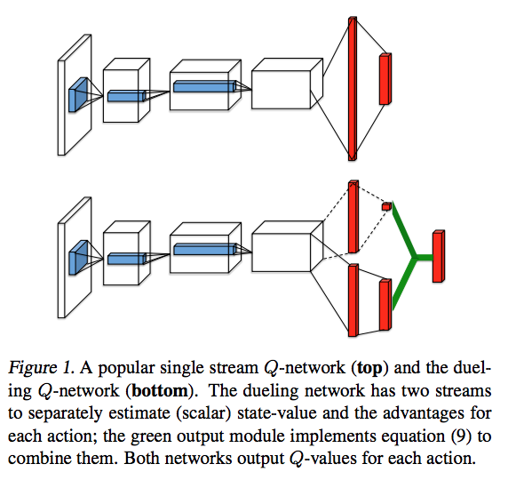
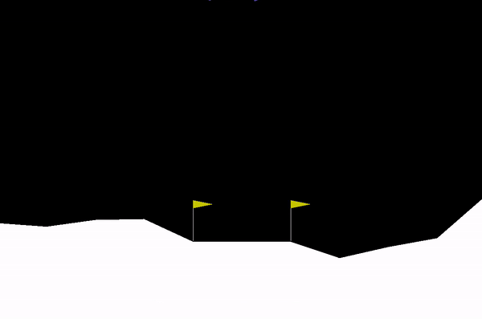
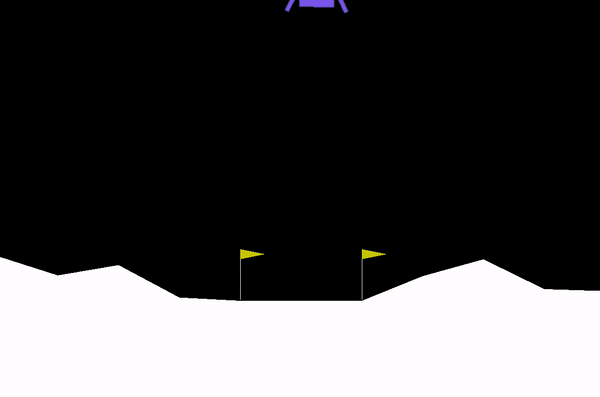

# Previously in RL

<a href="https://jsideas.net/drlnd_review_1/">이전 포스팅</a>에서 Cliff Walking 문제를 풀어보며 Reinforcement Learning에 대해 알아보았다.

Cliff Walking은 agent가 절벽에 떨어지지 않고 시작점에서 끝점까지 가장 빠르게 이동하는 길을 찾는 문제였다. agent는 처음에는 random policy에 따라 마구잡이로 움직이다가, 수많은 에피소드를 시행해보며 점차 어떤 state에서 어떤 action이 얼마만큼의 가치를 지니는지 이해하게 된다. 이때 state-action의 가치를 갱신하기 위해 48(#states) x 4(#actions) 크기의 Q테이블을 만들었다. 그리고 Q Learning 등의 방식을 사용해 Q테이블의 값을 추정하고 최적의 policy를 얻을 수 있었다.

*Cliff Walking 문제*

 

# RL + NN

Cliff Walking은 간단한 RL으로 풀리는 매우 쉬운 문제였다. state와 action의 가짓수가 유한한 discrete 문제인데다 경우의 수도 작은 편이라, 고정된 크기의 Q테이블과 Q Learning을 통해 문제를 풀 수 있었다.

그러나 우리가 실제로 풀고자 하는 현실 세계의 RL 문제들은 이보다 훨씬 복잡하다. 예를 들어 바둑은 Cliff Walking처럼 discrete한 문제이지만, 그 경우의 수가 계산불가능할 만큼 복잡하기 때문에 Q테이블을 만드는 것 자체가 무의미하다. 

또 Q테이블을 만드는 방식은 문제 자체가 아예 continous한 경우 state나 action은 무한한 실수값을 가질 수 있으므로 테이블 자체가 만들어지지 않는다. 예컨대 로봇 청소기가 돌아다니는 공간은 다양한 크기와 형태를 가진 사물들로 이루어진 공간이다. 이를 그리드월드처럼 격자로 자르거나, 혹은 다양한 타일로 겹쳐서 문제를 풀 수도 있다. 공간을 대강 자르면 기존 방식으로 학습은 할 수 있으나 그 성능이 떨어질 것이고, 정교하게 격자를 구성하면 그만큼 경우의 수가 대폭 증가해 학습이 어려워지는 문제가 발생한다.

  

*계산이 거의 불가능할 정도로 복잡한 바둑*

스타크래프트를 할 때 우리는 모든 유닛의 위치와 이동속도를 고려해 다음 유닛의 좌표를 선택하지 않는다. 대신 나의 자원 수급, 유닛 생산, 유닛 구성 등의 정보와 상대방의 최신 정보를 복합적으로 판단하고, 공격, 견제, 방어 등의 추상적인 의사결정을 내린다. 그리고 그 의사결정을 수행하기 위해 바쁘게 마우스와 키보드를 조작한다.

복잡한 문제에 대처하는 RL도 마찬가지다. 모든 경우의 수를 정확하게 계산하는 것은 불가능하기 때문에 주어진 상황에 현명하게 대처할 수 있는 어떤 추상적인 지식을 학습하는 관점으로 접근한다. 알 수 없는 true q함수를 직접 구하는 대신 function approximation을 사용해 이를 적절히 근사하는 함수를 구한다. 이때 approximator로 사용하는 옵션 중 하나가 Neural Network다.

$q_{\pi}(s, a) \approx \hat{q}(s, a, W)$

$W$는 Neural Network의 파라미터 벡터(weight)다. q함수의 인자인 state $s$와 action $a$를 파라미터 $W$를 가진 네트워크에 통과시켜 action-value를 얻게 된다. 우리가 원하는 true q함수 값에 근접한 값을 얻기 위해, $q_{\pi}(s, a)$와 $\hat{q}(s, a, W)$간의 차이가 최소화되도록 $W$를 최적화하는 것이 RL + NN의 학습방식이다.

 

# Deep Q Learning

NN을 function approximator로 사용해 RL로 복잡한 문제를 풀려는 시도는 2000년대 이전에도 있어왔지만, 2015년 DeepMind에서 Atari 게임을 깨기전까지는 성공에 이르지는 못했다. <a href="https://storage.googleapis.com/deepmind-media/dqn/DQNNaturePaper.pdf">DQN</a> 논문에서는 RL+NN의 학습이 불안정하고 diverge하는 이유를 다음과 같이 기술한다.

1. the correlations present in the sequence of observations
2. the fact that small updates to $Q$ may significantly change the policy and therefore change the data distribution
3. the correlations between the action-values($Q$) and the target values $r + \gamma max_{a^\prime} Q(s^\prime, a^\prime)$

개/고양이를 분류하는 Supervised Learning 모델을 떠올려보자. 각 feature-label 페어 (관측치)는 서로 독립이다. 직전 샘플이 고양이라고 해서 다음 샘플도 고양이가 될 가능성은 없다. 하지만 Q Learning에서는 이번에 선택한 action이 다음 state에 영향을 주고, 그 영향이 다음 action으로도 이어질 가능성이 높다. 싱글 스쿼시를 할 때 오른손 포어핸드로 공을 직선으로 치면 게임이 끝날때까지 오른손만 사용하게 된다.

어떤 샘플을 고양이라고 예측했다고 해서 그 이후에 뽑을 샘플에 영향을 주지 않는다. 하지만 Q Learning에서는 이번 시점의 예측이 Q함수에 영향을 주고, Q함수에 의거해 policy가 만들어진다. 그리고 policy에 의거해 action을 수행하므로 이후 {S, A, R, S} 샘플이 과거 예측에 의해 영향을 받는다.

마지막으로 개/고양이 분류 문제에서 우리는 이미 정답을 가지고 시작한다. 하지만 Q Learning에서는 정답을 모른다. Bellman Equation을 사용해 현재 시점의 Q함수 값은 바로 다음의 reward와 그 다음 시점의 Q함수 값의 합으로 구하고 이를 target으로 정의한다. 

$Q(s, a) = Q(s, a) + \alpha (r + max_{a^\prime} Q(s^\prime, a^\prime) - Q(s, a))$

prediction과 target간의 차이를 좁히는 것을 목표로 하는데, 둘 다 같은 Q함수를 기반으로 계산한다.

    <iframe
            src="https://www.youtube.com/embed/_x4uzhkiNbE"
            width="700"
            height="480"
            frameborder="0">
    </iframe>

*영상 초반부) 포어핸드 -> 오른쪽 벽 -> 포어핸드 -> 오른쪽 벽 -> ...*

이러한 세가지 문제를 <a href="https://storage.googleapis.com/deepmind-media/dqn/DQNNaturePaper.pdf">DeepMind에서 발표한 DQN</a>에서는 Experience Replay와 Fixed Q Targets라는 방식을 사용해 해결한다. 그리고 그 결과는 우리가 익히 아는 Atari Game이다.

*DQN playing Atari Breakout (source: Gfycat)*

 

### Experience Replay

기존 Q Learning에서는 관측치(${S_t, A_t, R_{t+1}, S_{t+1}}$)를 생성하고 바로 Q함수를 업데이트하는 과정을 반복해 학습했다. 직전 관측치가 다음 관측치에 영향을 주다보니 학습이 잘 안되는 문제가 있었다. 이 방식의 또다른 문제는 데이터 효율성이다. 생성한 관측치는 Q함수 업데이트에 한번 사용되고 버려진다. 학습에 도움이 되는 귀중하고 희귀한 샘플 역시 한번 사용되고 버려지기 때문에 이 방식은 효율적이라 보기 어렵다.

학습할 때 우리는 눈앞의 경험 뿐만 아니라 관련된 과거의 경험을 상기한다. 예를 들어 폭죽에 불을 붙일 때 당장 손에 전해지는 온도도 신경쓰지만, 과거에 불에 데인 경험을 통해 손을 어떻게 보호해야할지 판단한다. 

Experience Replay를 사용하는 agent는 관측값을 얻을 때마다 ReplayBuffer에 이를 저장하고, 저장된 history를 샘플링해서 Q함수를 업데이트하는 재료로 사용한다. 이를 통해 앞서 설명한 Q Learning의 두가지 문제점을 해결한다.

생성한 관측값을 바로 쓰는 것이 아니라 uniform random sampling을 통해 관측값을 추출하므로, 관측값간의 시간순서가 사라져 상관성 문제에서 자유로워진다. 또 ReplayBuffer에 관측값을 담아두고 샘플링하기 때문에, 희귀한 샘플이 버려지지 않고 재사용될 수 있다.

 

### Fixed Q Targets

두번째는 Fixed Q Targets다. 일반적인 Q Learning은 당나귀 뒤에 올라타 낚시대로 당근을 드리우고 당나귀가 곧게 걷기를 바라는 것과 같다. 

    <iframe
            src="https://www.youtube.com/embed/-PVFBGN_zoM"
            width="700"
            height="480"
            frameborder="0">
    </iframe>

*잘 될것 같지만 실제로 해보면 직진하기 어렵다.*

당근을 든 손을 곧게만 유지하면 당나귀가 직진할 것이라고 생각하지만, 실제로는 잘 안된다. 당나귀와 사람, 그리고 낚시대와 당근이 모두 연결되어 있기에, 당나귀가 움직이면 올라탄 사람도 흔들리고 그에 따라 당근도 흔들린다. 결국 영상에서처럼 당나귀는 직선으로 이동하는데 실패한다.

당근의 위치를 Q함수의 타겟($r + max_{a^\prime} Q(s^\prime, a^\prime)$)으로, 당나귀의 움직임을 추정치($Q$)로 대입해보면 된다. 타겟과 추정치의 오차를 줄여야하는데, $Q$의 변화에 따라 타겟과 추정치가 모두 함께 변화하면 안정적인 학습(이동)이 어려워진다.

DQN에서는 당나귀와 당근을 분리시키는 Fixed Q Targets 방법을 사용해서 문제를 해결한다. Q함수를 추정하는 네트워크(local network)와 Target을 설정하는데 사용하는 네트워크(target network)로 추정과 평가를 분리한다. 당나귀 등에서 내려서 낚시대를 드리우면, 당근의 위치는 더이상 당나귀의 움직임에 영향을 받지 않는다.

그리고 target network의 업데이트 주기를 local network보다 더 느리게 만듦으로써 목표가 자주 휘청이지 않도록 한다. DQN 구현에서는 local network가 4번 업데이트될 때 한번씩 target network의 파라미터를 local network의 파라미터를 사용해 soft update한다.

 

# Double Q Learning

DQN이 성공적으로 Atari 문제를 푸는데 성공했지만, Q Learning 자체가 가진 Overestimation 문제까지 풀지는 못했다. Thrun과 Schwartz는 1993년 발표한 <a href="https://www.ri.cmu.edu/pub_files/pub1/thrun_sebastian_1993_1/thrun_sebastian_1993_1.pdf">Issues in Using Function Approximation for Reinforcement Learning</a>에서 approximation 과정에서 생기는 노이즈가 max operator로 인해 action-value를 과대계상(overestimate)하고, 이는 최적의 policy를 학습하는데 방해요소로 작용한다고 주장한다. 이에 대해서는 <a href="https://jsideas.net/drlnd_issues_in_using_function_approximation/">이전 블로그 포스팅</a>을 통해 간단히 알아보았다.

2015년 말 DeepMind에서는 위 논문의 주장을 확장시켜 max operator 외에도 다른 여러 요소들이 estimation error를 일으키고 optimal policy 학습을 저해하는 것을 실험을 통해 보여준다. 그리고 이러한 DQN의 단점을 보완하는 <a href="https://arxiv.org/pdf/1509.06461.pdf">Double DQN</a>을 제안한다. 

### Decouple the selection from Evaluation

Q Learning에서 target $Y_t^Q$는 다음과 같이 정의한다.

$Y_t^Q \doteq R_{t+1} + \gamma max_a Q(S_{t+1}, a; \theta_t)$

DQN의 target은 Fixed Q Targets를 사용하므로 local network($\theta_t$)가 아닌 target network의 파라미터($\theta^-_{t}$)를 사용한다. .

$Y^{DQN}_t \doteq R_{t+1} + \gamma max_a Q(S_{t+1}, a; \theta^-_t) $

이 두 식은 모두 target $Y_t$를 계산할 때 다음 state에서의 greedy action을 뽑는 selection 행위와 그 action의 가치를 평가하는 evaluation을 같은 모델을 사용해서 얻는다. Q Learning에서는 $\theta_t$를, DQN에서는 $\theta^-_t$를 쓴다.

위에서 설명했다시피 강화학습에서는 학습의 목표인 target의 참 값을 알 수 없다. DQN의 $\theta^-_t$ 역시 true $\theta$의 근사값, guess일 뿐이다. 다만 DQN이 증명했듯, 수많은 샘플을 통해 어느정도 만족스런 성능을 내는 수준으로 파라미터를 업데이트하고 Atari 문제를 풀 수 있었다.

DDQN은 노이즈에 조금 더 견고한 DQN이라 할 수 있다. 학습의 후반부에 이르면 노이즈는 많이 줄어들지만, 샘플도 적고 파라미터도 안정되지 않은 초반부에는 작은 오류에도 모델이 크게 흔들릴 수 있다. DDQN은 target을 계산할 때 다음 state의 최댓값을 뽑는 과정을 1) 가장 값이 높은 액션을 뽑는 과정 2) 해당 액션의 값을 추정하는 과정으로 분리하고 이를 각각 다른 네트워크에 맡겨 견고함을 높였다.

다시 $Y_t^{DQN}$을 보자.

$Y^{DQN}_t \doteq R_{t+1} + \gamma max_a Q(S_{t+1}, a; \theta^-_t) $

$max_a Q(S_{t+1}, a; \theta^-_t)$를 selection과 evaluation으로 분리한다.

$Y_t^{DoubleQ} \doteq R_{t+1} + \color{red}\gamma \color{red}{Q(S_{t+1}, }\color{blue}{argmax_a Q(S_{t+1}, a; \theta_t)}\color{red}{; \theta^-_{t})}$

이때 greedy action을 뽑는 selection은 local network로, 이 값의 가치는 target network를 사용해 추정하도록 구현한다.   

 

# Prioritized Experience Replay

DQN의 Experience Replay Buffer의 샘플링을 통해 Replay는 연속된 관측값들이 가지는 상관성의 고리를 끊고, 강화학습의 학습 방식을 supervised learning과 같은 형태로 변환했다. DQN에서는 매 학습주기마다 Replay Buffer에서 학습 샘플을 uniform random sampling의 방식으로 얻었다.

그런데 우리가 게임을 할 때 승패에 지대한 영향을 주는 사건이나 경험은 드문드문 발생한다. 대부분의 경험은 그에 비해 상대적인 중요성이 떨어진다. 우리가 학습시킬 강화학습 agent 역시 uniform random sampling으로 모든 경험을 균등하게 취급할 것이 아니라, 더 중요하고 희소한 경험들에 더 가중치를 주어야 하지 않을까? 이것이 2015년 DeepMind에서 발표된 <a href="https://arxiv.org/abs/1511.05952">Prioritized Experience Replay</a>(이하 PER)의 핵심 아이디어다.

### TD Error as a reasonable proxy

agent가 env안에서 쌓는 수많은 experience tuple {$S, A, R^\prime, S^\prime$} 중에 어떤 경험이 더 중요한 경험일까? 중요한 경험을 무엇을 기준으로 정량화할 수 있을까? 어떤 경험으로부터 얻는 교훈의 크기가 클수록 그 경험이 중요하다고 할 수 있겠지만, 이는 강화학습에서 직접적으로 얻을 수 없다.

대신 DeepMind에서는 TD error $\delta$의 크기를 그 대체재로 사용한다. TD Error은 Q Learning시 Target Q와 Expected Q값의 차이를 의미한다.

$\delta = \color{red}{R_{t+1} + \gamma max_a \hat{q}(S_{t+1}, a, W)} - \color{blue}{\hat{q}(S_t, A_t, W)}$

PER에서는 각 경험의 가중치를 `priority`로 명명하고 다음과 같이 정의한다.

priority $p_t = \mid\delta_t\mid + \epsilon$

TD Error $\delta$의 크기를 구해야 하므로 절대값을 씌운다. 그리고 아주 작은 양의 constant $\epsilon$을 더해주는데, 만약 target과 expected 값이 완전 같아 $\delta$가 0이 되어버리면 해당 경험은 아예 뽑히지 않을 가능성이 생기기 때문이다. 모든 경험이 약간씩은 추출될 가능성을 담보하는 역할을 $\epsilon$이 수행한다.

### hyperparameter $\alpha$

priority를 샘플링 확률로 그대로 사용하면 priority가 높은 소수의 샘플만 계속 학습에 사용될 가능성이 있다. 이를 어느정도 조절하기 위해 하이퍼파라미터 $\alpha$를 사용해 sampling probability $P(i)$를 계산한다.

sampling probability $P(i) = \frac{p_i^\alpha}{\Sigma_kp_k^\alpha}$

$\alpha$는 0과 1사이의 값으로, 0이 되면 $P(i) = \frac{1}{k}$가 되어 uniform random sampling과 같아진다. 그리고 1이 되면 $P(i) = p_i$이 되어 priority가 그대로 샘플링 확률에 반영된다.

논문에서는 적절한 $\alpha$를 0.6이나 0.7로 설정했다.

### hyperparameter $\beta$

이전 포스팅에서 다룬 Monte Carlo Methods로 잠시 돌아가보자. Monte Carlo 방식은 수많은 episode 샘플을 생산한 다음, 각 episode를 순회하면서 state-action에 해당하는 Q테이블의 값을 업데이트하는 방식을 취했다. 이때 MC Control with Incremental Mean은 state-action pair의 관측값의 이동평균을 구하는 방식인데, 계산을 편하게 하기 위해 다음과 같은 식으로 값을 업데이트했다.

$Q \leftarrow Q + {1\over{N}} (G - Q)$

G는 해당 에피소드의 state-action 값, Q는 누적 이동평균의 값, N은 에피소드의 횟수를 의미한다. 에피소드가 계속 쌓일수록 N이 커져 업데이트의 크기가 줄어드는 문제를 해결하기 위해 $1\over{N}$을 상수 $\alpha$로 바꾸는 Constant Alpha 방식을 사용하게 되었다.

$\alpha$를 사용하더라도 각 샘플별로 다른 값이 곱해지는 것은 아니기 때문에 모든 샘플이 똑같이 사용되지만, PER에서는 priority를 사용하기 때문에 가중치가 높은 샘플들이 더 많이 사용될 가능성이 매우 높다. PER이전까지는 uniform distribution을 따르는 샘플링을 썼기 때문에 이러한 균등 가정을 깨뜨릴 이유가 없었다. 

non-uniform random sampling에 따른 bias를 보정하기 위해 PER에서는 파라미터 업데이트때 importance-sampling (IS) weight를 곱해주고, 보정을 어마할지 결정하는 하이퍼파라미터 $\beta$를 사용한다.

$w_i = (\frac{1}{N}\frac{1}{P(i)})^\beta$

$\triangle w = \alpha \color{red}{w_i} \delta_i \triangledown_w \hat{q}(S_t, A_t, w)$

$\beta$는 0과 1사이의 값으로 1이 되면 non-uniform probabilities $P(i)$를 완전 보상하고 0이 되면 $w_i$가 1이 되어 사라진다.

보통 강화학습에서 bais를 수정하는 것은 convergence가 일어나는 학습 후반부에 중요해진다. 따라서 논문에서는 시작값 $\beta_0$를 0.4나 0.5로 설정한다음, 학습 종료시 1이 되도록 선형적으로 증가시켰다. 

 

# Dueling Network

Double DQN은 DQN의 target value 산출 방식을 개선했고 Prioritized Experience Replay는 좀 더 중요도가 높은 샘플에 더 집중하도록 샘플링 방식을 개량했다. 이번에 살펴볼 <a href="https://arxiv.org/pdf/1511.06581.pdf">DeepMind의 Dueling Network</a>는 더 나은 네트워크 구조를 제안한다.

우리가 스타크래프트를 할 때 저글링 한부대를 이동시키는 행위는 무수하게 많이 일어난다. 하지만 기지 주변을 탐색하려고 이동시키는 행위와, 멀티가 공격받아 급히 이동시키는 행위는 같은 행위라도 중요성과 의미가 다르다. 

마찬가지로 DQN이 푸는 문제들 중 일부는 action이 바뀌어도 state의 value는 거의 차이가 없는 경우가 있다. Dueling Network는 네트워크 구조 내부에서 state의 가치를 추정하는 state stream과 action의 가치를 계산하는 advantage stream을 통해 이 문제를 해결한다. DeepMind의 실험결과 Dueling Network는 기본 DQN에 비해 훨씬 더 나은 성능을 보였다고 한다.

### Dueling Network Architecture

기존의 DQN 네트워크와 동일하게 Dueling Network 역시 state $s$가 취할 수 있는 action들의 value를 리턴한다. 그러나 네트워크 후반부가 조금 다르게 생겼다. 먼저 Atari Games의 raw screen을 convolution layer로 읽어들여서 feature를 추출하는 부분은 같다. 하지만 이후에 2개의 stream으로 나누어진다. 

위에 있는 stream은 state-value를 추정하는 부분이다. 네트워크는 state 1개를 인자로 받으므로 해당 레이어의 아웃풋은 [batch_size x 1]크기의 텐서가 된다.

밑에 위치한 stream은 advantage stream으로 각 action의 가치를 추정한다. 이는 DQN과 동일하게 [batch_size x #actions] 크기의 텐서를 출력한다. 

이 두개의 값을 얻은 후 합산하여 리턴하는 것이 Dueling Network의 기본 구조다.

### 그런데 그냥 합산하는 것은 아니다.

feature extraction layer의 파라미터를 $\theta$, state stream 레이어의 파라미터를 $\beta$로, advantage stream 레이어의 파라미터를 $\alpha$로 두면 각 stream의 아웃풋은 다음과 같이 정의할 수 있다.

state stream $V(s; \theta, \beta)$

advantage stream $A(s, a; \theta, \alpha)$

최종적으로 얻고자 하는 추정값은 이 둘의 합으로 간단히 만들어볼 수 있다.

$Q(s, a; \theta, \alpha, \beta) = V(s; \theta, \beta) + A(s, a; \theta, \alpha)$

그런데 이렇게 나이브하게 네트워크를 구성해서 돌리면 별로 좋은 성과가 나지 않는다. 그냥 딱 봐도 파라미터 수만 조금 늘어날 뿐 DQN과 크게 달라보이지 않는다.

유념해야 할 것은 $Q(s, a; \theta, \alpha, \beta)$는 true $Q$함수의 근사치에 지나지 않는다는 점이다. 또한 그 내부의 $V(s; \theta, \beta)$와 $A(s, a; \theta, \alpha)$가 믿을 수 있는 state와 action value를 추정할 것이라 믿는 것도 잘못되었다.

네트워크 내부에서 두 stream을 합산해버리면 이들이 가진 각각의 특성을 찾을 수 없게 되어 버린다. $V(s; \theta, \beta)$에 작은 constant를 더하고 $A(s, a; \theta, \alpha)$에서 같은 값을 뺀다음 stream을 합산하면 constant는 결국 상쇄되어 사라지고 만다. 즉 두 stream이 분리되지 않는다.

이 문제를 해결하기 위해 논문에서는 advantage function estimator $A(s, a; \theta, \alpha)$에서 자체의 최대값이나 평균을 빼는 방식을 취한다. 평균을 뺀 advantage stream을 사용한 네트워크는 다음과 같이 구성된다.  

$$Q(s, a; \theta, \alpha, \beta) = V(s; \theta, \beta) + \Big(A(s, a; \theta, \alpha) - \frac{1}{|A|}\Sigma_{a^\prime} A(s, a^\prime; \theta, \alpha)\Big)$$

이로서 state의 값과 해당 state에서의 action의 값이 분리되어 네트워크를 통과한다.

 

### Saliency Map Result

Dueling Network는 정말 state와 action을 분리시킬 수 있을까? action이 중요하지 않은 상황과 중요한 상황에서 advantage stream은 다르게 행동할까?

DeepMind 논문에서 Enduro라는 자동차 주행 게임을 대상으로 실험을 했는데 결과가 재밌다. Saliency Map을 사용해 이미지 위에 각 stream이 반응한 영역을 확인해보았는데..

장애물이 없는 상황에서는 advantage stream이 반응하지 않았지만, 눈앞에 장애물이 있는 하단의 상황에서는 장애물 부근에 반응하는 것이 나타난다. state의 value를 표현하는 stream이 지평선의 끝부분과 점수 포인트 부근에 집중하는 것도 흥미로운 포인트다.

# Implementation

이번에 DQN, Double DQN, Proritized Experience Replay 그리고 Dueling Network를 공부해보면서 OpenAI의 LunarLander-v2 환경에서 구현을 해보았다(<a href="https://github.com/junkwhinger/dqn">구현 코드</a>). 스크린샷을 그대로 학습에 사용하는 Atari 실험에 비해 LunarLander-v2의 문제는 훨씬 간단한 편이다. 부스터를 쓰면서 깃발 사이로 우주선을 안착시키는 게임인데, state는 위치, 속도, 각도 등 8가지 숫자로 구성되어 CNN을 쓰지 않아도 된다. 덕분에 빠른 시간내에 DQN의 학습 결과를 볼 수 있는 적절한 환경이라 하겠다.

성능비교를 위해 다음과 같은 4가지 모델을 만들었다.

1. DQN
2. Double DQN
3. Double DQN + Prioritized Experience Replay
4. Dueling Network + Prioritized Experience Replay

### 학습 score 비교

모델별로 최근 100개의 score 이동평균을 가져와 약간의 스무딩을 거친 후 비교해보았다.

Vanilla DQN에 비해 다른 모델들의 score가 더 빨리 상승하고 더 높은 지점에 도달하는 것을 알 수 있다. 실험 결과  Vanilla DQN의 최고 score는 220 정도에 그쳤으나, 나머지 3개 모델은 모두 2000 iteration 내에 265를 기록했다. 

LunarLander-v2가 DeepMind에서 풀었던 Atari 문제에 비해 비교적 간단해서인지 후속 3가지 모델간에 유의미한 성능 차이는 발견하기 어려웠다.  

### Play LunarLander 

앞서 학습한 4가지 모델을 사용해 실제 LunarLander-v2를 플레이해보았다. seed값을 조정해 처음 state값에 변화를 줄 수 있는데, 테스트해본 값 중 42는 쉬운 편, 6은 어려운 편이었다. 이 두가지 seed로 구성된 환경에서 각 모델이 어떻게 플레이하는지 비교해보자.

### 쉬운 문제 (seed=42)

#### DQN

#### Double DQN

#### Double DQN + Prioritized Experience Replay

#### Dueling Network + Prioritized Experience Replay

 

### 어려운 문제 (seed=6)

#### DQN

#### Double DQN

#### Double DQN + Prioritized Experience Replay

#### Dueling Network + Prioritized Experience Replay

아래쪽 추력만 잘 컨트롤하면 되는 쉬운 문제는 모든 모델이 잘 풀었다. 하지만 처음부터 오른쪽으로 쏠린 상태에서 시작하는 어려운 문제에서 Vanilla DQN은 깃발 안으로 들어오지 못했다. 반면에 다른 모델들은 적절히 자세를 제어하면서 안쪽으로 들어왔다. Dueling Network의 성능이 생각보다 아쉽게 나왔는데 다음에 더 복잡한 환경에서 다시 한번 학습시켜봐야겠다.