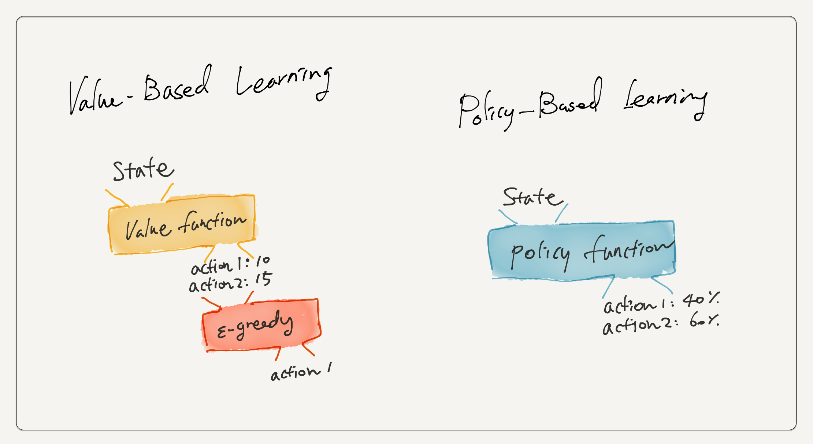
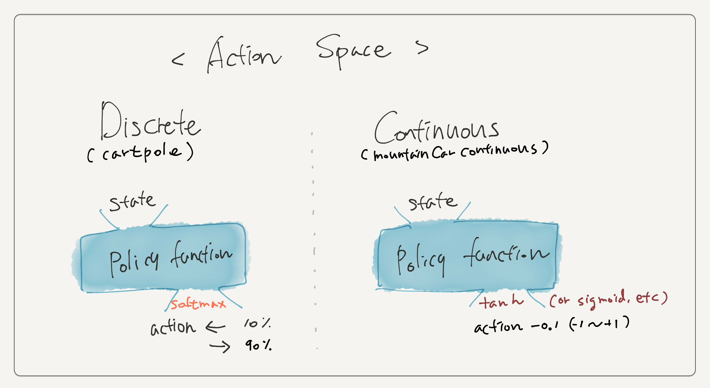
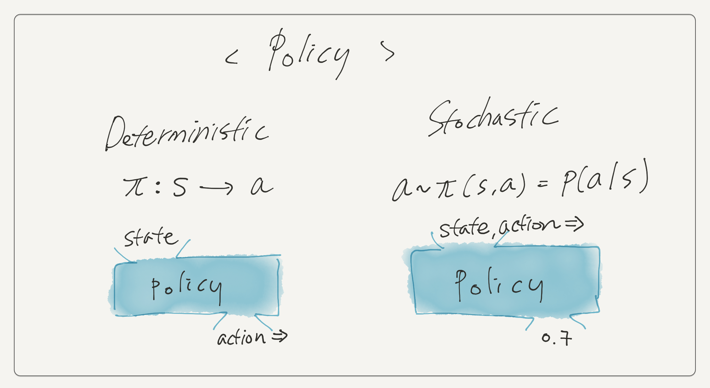
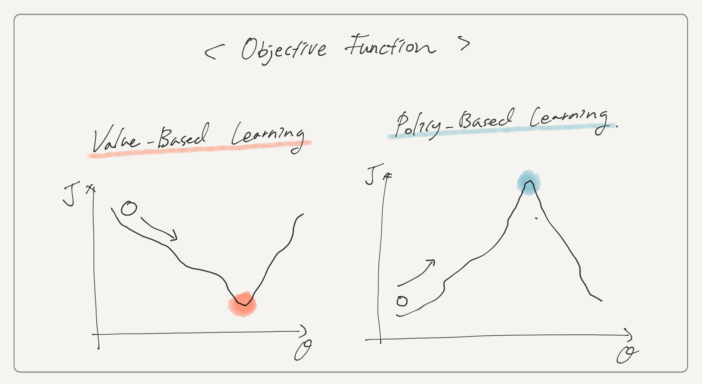
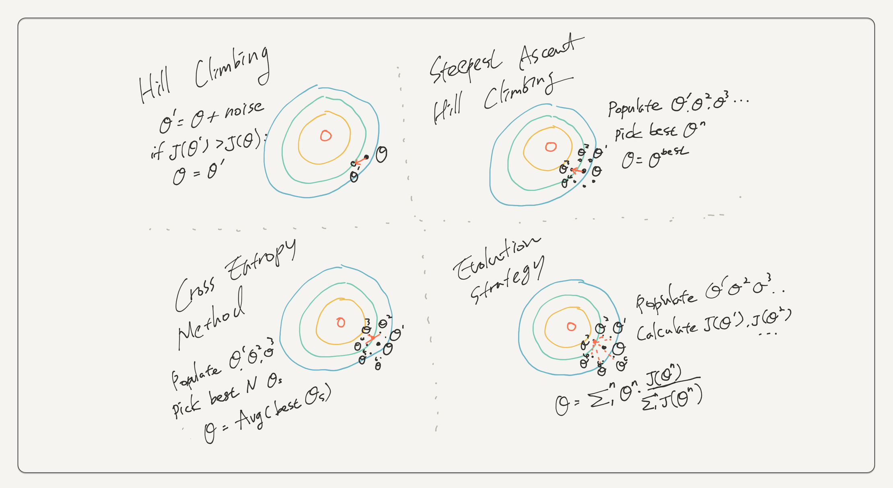

## Policy-Based Learning

이전 포스팅에서 Q-Learning을 사용해 Cliff Walking과 Lunar Lander 문제를 풀어봤다. 문제가 간단한 Cliff Walking에서는 Q 테이블을, 상대적으로 복잡도가 높은 Lunar Lander에서는 Neural Network를 이용한 Function Approximation을 사용했다. 두가지 방식 모두 state를 입력받아 취할 수 있는 action의 value를 추정한다. 그리고 $\epsilon-greedy$ 방식을 사용해 점차 greedy action (value가 가장 높은 action)을 선택한다. 이를 Value-Based Learning이라고 한다.



 value 추정(1단계)과 action 선택(2단계)을 거치는 Value-Based Learning과 달리, Policy-Based Learning은 state에서 바로 action을 뽑아낸다. Policy-Based Learning의 출력값은 action space의 형태에 따라 달라질 수 있다.

<br>

### Outputs of Policy-Based Learning

Policy-Based Learning은 문제의 Action Space가 discrete한지, continuous한지에 따라 출력의 형태가 조금 달라진다.



CartPole처럼 이동방향 좌/우 중 하나를 선택해야 하는 discrete한 action space에서 출력은 액션의 확률값이다. 따라서 Policy Network의 마지막 activation function은 `softmax` 를 쓴다. 

반대로 MountainCarContinuous v0 문제에서의 action값은 -1부터 +1사이의 값을 가진다. action이 -1에 가까우면 왼쪽 방향으로, +1에 가까우면 오른쪽 방향으로 차를 민다. -1에서 1사이의 값을 출력하기 위해 마지막 activation function으로 `tanh` 를 사용한다. 

CartPole과 비슷해보이지만, MountainCarContinuous v0에서의 action 값은 방향 뿐 아니라 그 강도도 표현한다. 즉 -1과 -0.5 모두 왼쪽으로 차를 밀지만 -1이 -0.5보다 더 세게 밀어낸다. MountainCarContinuous v0의 env의 step 함수를 보면 알 수 있다. env는 이 action 값을 현재 차의 `power`, `position` 등의 정보와 결합해 `velocity` 를 구하고 이를 통해 차의 정보를 갱신한다. 

```   python
#https://github.com/openai/gym/blob/master/gym/envs/classic_control/continuous_mountain_car.py
#...
def step(self, action):

        position = self.state[0]
        velocity = self.state[1]
        force = min(max(action[0], -1.0), 1.0)

        velocity += force*self.power -0.0025 * math.cos(3*position)
        if (velocity > self.max_speed): velocity = self.max_speed
        if (velocity < -self.max_speed): velocity = -self.max_speed
        position += velocity
        if (position > self.max_position): position = self.max_position
        if (position < self.min_position): position = self.min_position
        if (position==self.min_position and velocity<0): velocity = 0
#...
```

<br>

## Why Policy-Based Learning?

Value-Based Learning(DQN 등)으로도 강화학습 문제를 잘 풀었는데 왜 Policy-Based Learning도 알아야 할까? 그 이유는 크게 3가지가 있다.

<br>

### 1. Simplicity

Value-Based Learning에 비해 Policy-Based Learning이 더 간단하기 때문이다. Value-Based Learning은 1) action value 추정 2) action 선택의 2단계를 거치지만, Policy-Based Learning은 한번에 action을 뽑아버린다. 2단계를 1단계로 줄여버리니 더 간단하다고 할 수 있다.

또 Policy-Based Learning은 효용이 적은 데이터를 저장하지 않아도 되는 장점이 있다. 강화학습 문제에서 대부분의 state는 같거나 비슷한 value를 가질 수도 있다. 게임은 처음부터 끝까지 절체절명의 상황만 발생하지 않는다. 환경이 조금 바뀌거나 아무 행동이나 취해도 승패에 영향이 전혀 없는 구간도 존재한다. 이 state-action pair에 대한 값을 모두 따로 따로 추정하고 저장하는 것은 분명 큰 낭비다. 

Policy-Based Learning은 state나 state-action pair의 값을 추정하지 않고 바로 action을 결정하므로, 문제 해결에 더 중요한 영향을 주는 복잡한 state에 집중할 수 있다.

<br>

### 2. True Stochastic Policies

Policy-Based Learning의 두번째 장점은 진정한 의미의 Stochastic Policy를 구현한다는데 있다. Policy에는 state에 대한 action을 리턴하는 deterministic policy와 그 액션을 선택할 확률을 리턴하는 stochastic policy가 있다.  




Value-Based Learning에서는 $\epsilon-greedy$ 방식을 통해 action을 결정한다. $\epsilon$의 확률로 주어진 action 중 하나를 랜덤하게 선택하고, $1-\epsilon$ 의 확률로 value가 가장 높은 greedy action을 선택한다. 학습 초기에는 $\epsilon$ 값을 크게 가져가서 다양한 action을 선택하게끔 하지만(exploration), 점점 $\epsilon$ 을 낮춰가면서 학습한 값에 기초해 판단을 내린다(exploitation). 이렇듯 Value-Based Learning은 확률적(stochastic)으로 action을 선택하지만, 이는 $\epsilon$에 따른 확률적 선택이지, 실제 action의 진짜 확률값을 학습한다고 볼 수는 없다. 

반대로 (action space가 discrete한 문제에서) Policy-Based Learning에서는 state를 입력받아 각 action을 선택할 확률을 직접적으로 도출한다. 학습을 통해 Policy Network는 expected return을 최대화하는 방향으로 weight를 조정한다.

<br>

### 3. Continuous Action Space

마지막으로 Policy-Based Learning은 Continuous한 Action Space를 가진 문제를 그대로 처리할 수 있다는 장점이 있다. 

Value-Based Learning에서 사용한 Q-Learning이나 DQN 알고리즘은 모두 state-action pair의 값을 추정하는 방식으로 작동한다. MountainCarContinuous V0에 DQN을 적용한다고 생각해보면 아구가 안맞는 부분이 생긴다. 이 문제는 action을 -1과 1사이의 실수값으로 받는데 DQN은 각 액션의 값을 리턴하고 이 중 하나를 고른다. 여기서 DQN을 사용하려면 -1~-0.5, -0.5~0, 0~0.5, 0.5~1 같은 식으로 continuous한 action space를 discretise해야만 한다.

이에 반해 Policy-Based Learning은 별도의 변환과정 없이 continuous한 Action 값을 그대로 출력할 수 있다.


<br>

## Policy-Based Algorithms

이전에 살펴본 DQN류의 알고리즘은 Neural Network를 사용해 Q함수를 근사했다. 그리고 Bellman Equation을 사용해 Q함수의 추정값과 타겟값 ($Y_t^{DQN} \doteq R_{t+1} + \gamma max_a Q(S_{t+1}, a; \theta_t^-)$) 간의 차이를 최소화하는 것을 목표로 네트워크의 파라미터를 조정했다.

그런데 Policy-Based Learning은 별도의 타겟값을 목표로 학습하지 않는다. Q Network가 action의 value를 최대한 정확하게 추정하도록 학습한다면, Policy Network는 최적의 policy 자체를 학습하는 것을 목표로 한다. 최적의 policy를 학습했다면, 이를 사용해 agent가 얻는 expected return이 가장 커질 것이다.  

agent가 해당 policy를 사용해 얻는 expected return을 $J$라 표현한다면, $J$ 의 값은 사용한 policy의 파라미터 $\theta$에 따라 달라지므로 이를 $J(\theta)$ 로 표현할 수 있다.



그리고 Loss function을 minimise하는 Value-Based Learning(DQN류)나 일반적인 딥러닝 방법론과 달리 Policy-Based Algorithm은 $J(\theta)$를 maximise하는 것을 목표로 한다. 그래서 gradient를 사용하는 Policy Gradient류의 방법론들은 gradient descent가 아닌 gradient ascent를 사용한다. 자세한 내용은 다음 포스팅에서 알아보자.

<br>

## Non-Gradient Policy-Based Algorithms

policy가 좋은지 나쁜지는 이를 사용하여 얻은 expected return $J(\theta)$가 높아지는지를 보면 된다. gradient를 사용하면 $\theta$ 를 업데이트할 방향을 알 수 있겠으나, gradient 없이도 policy를 개선시킬 수 있는 방법이 여럿 있다.

파라미터  $\theta$ 에 약간씩 변화를 주어 $J(\theta)$ 를 계산한 다음, 이전 값에 비해 개선이 되었다면 점차 나은 policy에 가까워지고 있다고 판단하면 된다. 아래 소개하는 알고리즘들은 이 방식을 사용해 최적의 policy를 학습한다.



### 1. Hill Climbing

Hill Climbing은 가장 기본적인 방식으로 약간의 노이즈를 주어 새로운 $\theta^{\prime}$ 을 얻는다. 이를 사용해 얻은 $J(\theta^{\prime})$ 이 기존 $J(\theta)$ 보다 높다면 파라미터를 $\theta^{\prime}$ 으로 업데이트한다.

### 2. Steepest Ascent Hill Climbing

Hill Climbing은 한번에 한개의 $\theta^{\prime}$ 을 생성하고 비교한다. noise는 랜덤으로 생성되기 때문에 항상 더 나은 방향으로 파라미터가 개선되기 어렵다. 하나 대신 여러개를 생성하고 그 중에서 가장 $J$ 가 높은 파라미터를 선택하면 어떨까? 하는 것이 Steepest Ascent Hill Climbing이다.

### 3. Cross Entropy Method

Steepest Ascent Hill Climbing이 여러 파라미터 후보 중 $J$가 가장 높은 하나만 선택했다면, Cross Entropy Method는 가장 $J$가 높은 $N$ 개 혹은 $N$ %를 고른 후 이들 파라미터의 평균을 구한다.

### 4. Evolution Strategy

Cross Entropy Method가 가장 나은 파라미터들의 평균을 구했다면, Evolution Strategy는 각 후보의 $J$ 가 전체 $J$의 합에서 차지하는 비율 만큼을 weight로 사용해 파라미터의 weighted sum을 구한다. 즉 $J$ 가 높을수록 새로운 파라미터에 영향을 더 많이 주는 방식이다.

<br>

이 외에도 Noise를 뽑는 범위(search radius)를 미리 지정된 스케쥴에 따라 점차 줄여가는 Simulated Annealing이나 더 나은 policy를 얻음에 따라 범위를 줄여가는 Adaptive Noise Scaling 등이 있다.

 

다음에는 Policy Gradient를 사용한 방법에 대해 알아보자.