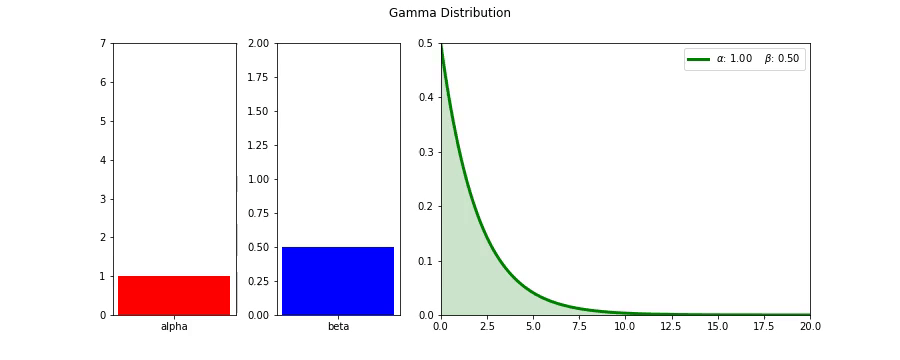

## celluloid

같은 팀에 똑똑한 동료로부터 오늘 신박한 파이썬 라이브러리를 하나 소개받았다. `celluloid`라는 녀석인데, matplotlib 플롯을 복잡한 애니메이션 함수를 쓰지 않고도 아주 쉽게 mp4 동영상으로 만들어준다.


보통 matplotlib으로 그린 플롯을 애니메이션처럼 움직이게 하려면 matplotlib의 `Animation` 클래스를 이용해야 하는데 이 방법이 좀 복잡하다 <a href="https://matplotlib.org/3.1.0/api/animation_api.html">link</a>. 업데이트하는 함수를 하나 만들고 프레임을 for loop을 돌면서 업데이트 함수를 콜하는 방식인데, 요소 요소를 하나씩 그리도록 설정해줘야 하다보니 손이 많이 간다. 나도 이전에 <a href="https://jsideas.net/bitcoin_dtw/">비트코인 가격 추이 분석</a>을 할때 애니메이션 그래프를 그리려다 너무 힘들어서 그냥 이미지를 저장한 다음 외부 툴을 사용해서 동영상으로 만들어버리기도 했다.

그런데 celluloid를 쓰면 이런 번거로움이 아주 쉽게 해결된다. 자세한 사용방법은 <a href="https://github.com/jwkvam/celluloid">Github</a>에 나와있는데, 대문에 걸린 sine파 코드로 간단히 살펴보면..

```python
"""https://github.com/jwkvam/celluloid/blob/master/examples/sines.py"""
"""Sinusoid animation."""

import numpy as np
import matplotlib
matplotlib.use('Agg')
from matplotlib import pyplot as plt
from celluloid import Camera

# 그림 그릴 공간을 확보한다.
fig, axes = plt.subplots(2)

# celluloid에서 Camera 인스턴스를 생성하는데, 이는 생성할 때 matplotlib의 figure를 인자로 받는다. 위에서 만든 fig를 넣어준다.
camera = Camera(fig)

# t가 x축의 값이 된다.
t = np.linspace(0, 2 * np.pi, 128, endpoint=False)

# t array를 순회하면서
for i in t:
    # t에 i만큼 더하고 뺀 값을 sin 함수에 통과시킨다음 플롯을 그리고
    axes[0].plot(t, np.sin(t + i), color='blue')
    axes[1].plot(t, np.sin(t - i), color='blue')
    # 이를 카메라로 찍는다.
    camera.snap()

# for loop이 종료되고나서 camera 인스턴스의 animate함수를 이용해서 이어붙인다음
animation = camera.animate(interval=50, blit=True)

# .mp4 파일로 저장하면 끝!
animation.save(
    'sines.mp4',
    dpi=100,
    savefig_kwargs={
        'frameon': False,
        'pad_inches': 'tight'
    }
)
```


그러니까 이젠 포문만 돌면서 플롯을 그리고 snap 사진을 찍은 다음, 마지막에 animate로 이어붙이면 아주 쉽게 동영상으로 만들 수 있게 된다.


## moviepy

그런데 아쉽게도 GIF로 저장은 지원하지 않는 모양이다. 그 이유는 celluloid에서 animate 함수를 콜하면 `matplotlib.animation.ArtistAnimation` 클래스로 인스턴스를 생성해서 리턴하는데, 이녀석이 GIF를 지원하지 않는다.

그래서 찾은 것이 `moviepy`. 이녀석을 이용하면 celluloid로 만든 mp4를 python으로 쉽게 불러다가 gif로 만들 수 있다. <a href="https://github.com/Zulko/moviepy">Github</a> 

```python
from moviepy.editor import *
# 파일명을 넣어서 쉽게 읽어들일 수 있다.
# speedx 등의 함수를 이용해 속도나 화면 로테이션 등을 쉽게 할 수 있다.
clip = (VideoFileClip("sines.mp4").speedx(2))

# write_gif 함수를 이용해 바로 gif로 만들 수 있다.
clip.write_gif("sines.gif")
```


## Examples

요새 팀 동료들과 베이지언 통계 책을 같이 읽고 있는데, 마침 사전확률분포로 많이 쓰이는 베타분포와 감마분포가 나왔다. 두 분포 모두 $\alpha$ 와 $\beta$ 를 파라미터로 사용하는데, 각 파라미터가 조금씩 달라질때마다 분포의 모양이 어떻게 변화할까? celluloid와 moviepy를 이용하면 아래와 같이 쉽게 만들어볼 수 있다.

```python
"""Gamma 분포에서 \beta는 고정하고 \alpha만 변화시키는 GIF"""
import matplotlib.pyplot as plt
from matplotlib import gridspec

import seaborn as sns
import celluloid
import numpy as np
import scipy.stats as stats
%matplotlib inline

from moviepy.editor import *

# Gamma 함수를 설정하고 alpha와 beta 범위를 잡아 array로 만들어둔다.
gamma = stats.gamma
alphas = np.linspace(1, 7, 100)
betas = np.linspace(0.5, 2, 100)

# Gamma 분포는 양의 실수값을 갖는다. 0.001~20까지로 구간을 한정하자.
x = np.linspace(0.001, 20, 150)

# 그림 그릴 영역을 잡는데, Gamma 분포의 값과 더불어 alpha와 beta값의 추이로 함께 넣어주자. GridSpec을 사용해 3개 영역을 잡는다. 
fig, ax = plt.subplots(figsize=(12.5, 5))
gs = gridspec.GridSpec(1, 3, width_ratios=[1, 1, 3]) 

# celluloid.Camera On!
camera = celluloid.Camera(fig)    

# beta를 0.5로 고정시키고
beta = 0.5
# alpha 값들을 순회하면서 그림을 그린다.
for alpha in alphas:
    ax0 = plt.subplot(gs[0])
    ax1 = plt.subplot(gs[1])
    ax2 = plt.subplot(gs[2])
    # ax0에는 alpha를 bar 플롯으로.
    ax0.bar("alpha", alpha, color='r')
    ax0.set_ylim(0, max(alphas))
    # ax1에는 beta를 bar 플롯으로.
    ax1.bar("beta", beta, color='b')
    ax1.set_ylim(0, max(betas))
    
    # x를 Gamma 분포의 확률밀도함수에 넣어 y를 얻는다.
    y = gamma.pdf(x, alpha, scale=1./beta)
    # 그리고 ax2에다 그린다.
    plot = ax2.plot(x, y, lw=3, color='g')
    ax2.fill_between(x, 0, y, alpha=0.2, color='g')
    # 레전드를 이용해서 바뀐 알파와 베타값을 표시해준다.
    plt.legend(plot, ['$\\alpha$: {:.2f}    $\\beta$: {:.2f}'.format(alpha, beta)])
    plt.autoscale(tight=True)
    plt.suptitle("Gamma Distribution")
    # 찰칵!
    camera.snap()
    
# for loop이 끝나고 mp4파일을 만든다.
animation = camera.animate()
animation.save("gamma_alpha.mp4")

# 만든 mp4를 불러와서 속도를 2배 빠르게 한다음 gif로 저장한다.
clip = (VideoFileClip("gamma_alpha.mp4").speedx(2))
clip.write_gif("gamma_alpha.gif")
```


이로서 매우 쉽게 Gamma 분포의 파라미터에 따른 형태 변화를 쉽게 GIF로 내릴 수 있다.

### Gamma 분포




### Beta 분포


## Reference

- celluloid (https://github.com/jwkvam/celluloid)
- moviepy (https://github.com/Zulko/moviepy)
- Probabilistic Programming and Bayesian Methods for Hackers (https://github.com/CamDavidsonPilon/Probabilistic-Programming-and-Bayesian-Methods-for-Hackers)