# Intro

강화학습 에이전트는 문제를 푸는 방법을 스스로 학습한다. 이전 포스팅 [Sokoban DQN + GradCAM](https://jsideas.net/Sokoban_DQN/)에서 학습한 DQN 에이전트는 처음에는 무작위로 행동을 하며 정보를 모은다. 상태(state)와 액션(action), 그에 대한 보상(reward)를 사용해 state-action 페어의 가치를 추정하는 모델을 학습한다. 어느정도 학습이 완료되면 문제를 잘 풀어내는 수준까지 도달한다.

사람의 개입 없이도 문제를 풀어낸다는 점은 큰 장점이지만, 반대로 학습에 시간이 꽤 많이 소요된다. 사람이 볼 땐 아주 피하기 쉬운 함정도 "당하면서 배우는" 방식으로 학습하다보니 답답하기 그지없다.

그렇다면 사람의 플레이를 따라하는 에이전트를 학습시켜보면 어떨까? 랜덤에 기대는 것보다 더 빠르고 쉽게 문제를 풀 수 있지 않을까? 이것이 Behavior Cloning(BC)이다. 이번 포스팅에서는 "텐서플로와 유니티 ML-Agents로 배우는 강화학습"의 챕터 10에 나오는 Dodge 게임 환경에서 실험한 내용을 정리해본다.

<br>

# Behavior Cloning

휴 잭맨이 나오는 영화 Real Steel에서 주인공 꼬맹이는 버려진 구식 전투 로봇을 주워다가 최고의 파이터 로봇으로 탈바꿈시킨다. 이 구닥다리 로봇에는 더이상 쓰이지 않는 미러링 기능이 들어 있어서, 연결된 사람의 행동을 그대로 모방한다.

<div style='position:relative; padding-bottom:calc(42.50% + 44px)'><iframe src='https://gfycat.com/ifr/AliveIlliterateHeifer' frameborder='0' scrolling='no' width='100%' height='100%' style='position:absolute;top:0;left:0;' allowfullscreen></iframe></div><p> <a href="https://gfycat.com/aliveilliterateheifer-dancing-robot-real-steel">via Gfycat</a></p>

영화 속 로봇은 사람의 행동을 그대로 모방할 뿐, 이를 기반으로 학습을 하여 자율적으로 행동하지는 않는다. 그렇기 때문에 영화의 말미에 휴 잭맨이 직접 복싱을 하면서 로봇을 조작한다. 학습의 관점에서 영화 속 로봇과 BC는 분명히 다르지만, 사람의 플레이를 사용한다는 점에서는 같다고 볼 수 있다.

## BC의 학습 방법

일반적인 강화학습은 환경과의 상호작용을 통해 정보를 얻는다. 이를 통해 주어진 state에 대해 action의 가치나 확률을 추정한다.

이와 달리 BC는 학습할 때 환경과의 상호작용을 필요로 하지 않는다. 전문가 플레이에서 {state, action}을 랜덤으로 꺼내온 다음, 주어진 state에 맞는 정답 action을 가장 잘 맞추도록 학습한다. 즉, 개/고양이를 판별하는 이미지 분류 모델과 정확하게 같은 방법으로 학습한다.

학습 방법을 요약하자면 다음과 같다.

1. 전문가(사람) 플레이를 녹화한다.
2. 녹화한 전문가 플레이로 데이터셋을 만든다.
3. 데이터셋을 이용해 모델을 학습한다. 학습 방법은 일반적인 ML과 동일하다.
4. 훈련된 모델을 가져와서 게임을 플레이한다. (logit을 softmax로 확률로 변환한 다음, 이 확률을 기반으로 action을 선택한다)

<br>

# BC with Unity ML-Agents

모델 학습 자체는 일반적인 멀티 클래스 분류 학습과 동일하므로 어려울 것이 없다. 가장 어려운 부분은 사람이 직접 플레이를 한 전문가 데이터를 확보하는 것인데, Unity로 환경이 만들어져 있다면, 이 데이터를 아주 쉽게 구할 수 있다.


Agent의 Inspector 창에서 `Demonstration Recorder` 와 `BC Teacher Helper`컴포넌트를 추가해주면 된다. ML-Agents 툴킷이 깔려있다면 별도의 설치 없이 쉽게 클릭만으로 추가할 수 있다.

`Record`가 활성화된 상태로 Scene을 Play하면 즉시 게임 녹화가 시작된다.


플레이가 마음에 들지 않으면 키조작으로 리셋도 가능하다. Scene을 멈추면 이제까지 녹화된 데이터가 `.demo` 파일로 저장된다.

전문가 플레이 데이터를 학습에 사용하려면 numpy 형태로 변환해야 한다. mlagents에 내장된 함수를 이용하면 아래처럼 쉽게 데이터를 numpy array로 변환할 수 있다. Dodge에서는 state가 게임 화면이 아닌 주변 장애물이나 벽까지의 거리가 담긴 벡터(60개 숫자, 30개 * 2스택)로 되어 있다.

```python
import numpy as np
from mlagents.trainers.demo_loader import demo_to_buffer

def load_demo(path):
    brain_params, demo_buffer = demo_to_buffer(path, 1)
    update_buffer = demo_buffer.update_buffer
    return update_buffer

buffer = load_demo("../Assets/Demonstrations/Jun2.demo")

state = np.array(buffer['vector_obs'])
action = np.array(buffer['actions'])
reward = np.array(buffer['rewards'])

print(state.shape)
# > (3271, 60)

print(action.shape)
# > (3271, 1)
```

<br>

# Environment

이번에 책을 따라해보면서 만든 게임 환경은 Dodge다. 간단한 장애물 피하기 게임으로, 에이전트(파란색 네모)가 장애물(오렌지색 공)을 피해서 최대한 오래 살아남는 것이 목표다.


### State

에이전트는 자기 주변으로 30개의 광선(ray)을 12도씩 간격을 두고 발사한다. 광선이 장애물이나 벽에 도달하면 에이전트와의 거리(distance)를 계산한다. 즉 30개의 숫자가 담긴 벡터가 state가 된다. 책의 예제에서는 이를 2개 쌓아서(stack) 총 60개의 숫자를 state로 사용한다.

광선이 닿는 위치를 이어서 표현해보면 아래 녹색 선과 같다. 카메라 표시 바로 아래에 파란색 네모 에이전트가 있다. Unity를 열어 Scene을 실행하고 멈춤 버튼을 누르면 `DebugRay`에 담긴 정보가 아래처럼 표시된다.


### Action

Dodge 게임의 액션은 {가만히 있기, 상, 하, 좌, 우}로 총 5가지이다.

### Reward

에이전트가 장애물과 충돌하면 -1점을 받고 게임이 종료된다. 그렇지 않으면 매 스텝마다 +0.1 보상을 받는다.

<br>

# Experiments

BC 에이전트로 Dodge를 잘 풀어낼 수 있을까? 여러가지 가설을 세우고 실험을 해보았다.

<br>

## 1. BC Training

BC 에이전트 학습에는 몇가지 주의 사항이 있다.

1. 보상이 음수인 플레이 기록을 데이터셋에서 제거한다. BC는 reward를 높이는 것이 아니라 녹화된 액션을 최대한 모방하도록 학습하기 때문에, 잘못된 사례를 가르치지 않도록 주의해야 한다.
2. 오버피팅에 주의해야 한다. 딥러닝 모델은 표현력이 매우 좋기 때문에 학습 데이터가 적으면 이에 과적합되는 경우가 많다. BC도 마찬가지다. 전문가 데이터를 대량으로 모아서 학습하면 낫겠지만, 이번 예제에서는 대략 100초 ~ 500초 정도의 데이터만으로 학습하므로, 오버피팅에 취약하다. 때문에 예제에서는 policy 모델에 `dropout` 레이어를 추가하여 과적합을 방지한다. 나는 여기에 train-validation split을 넣어, validation accuracy가 가장 좋은 model을 테스트 플레이의 모델로 사용했다.
3. seed값을 고정해야 한다. Dodge에서는 seed값에 따라 처음에 나오는 장애물 공의 위치와 속도가 정해진다. 전문가 플레이의 길이가 길지 않다면, seed 값을 고정해서 녹화한 후, 테스트할 때도 같은 seed를 써야 좋은 성능이 나온다. BC 에이전트는 플레이를 따라하도록 학습이 되니, 짧은 플레이를 보여주고 다양한 환경에 대응하리라 기대하는 것은 무리다.

대략 100초간의 플레이를 저장한 후, 학습해보면 다음과 같은 메트릭을 얻을 수 있다.

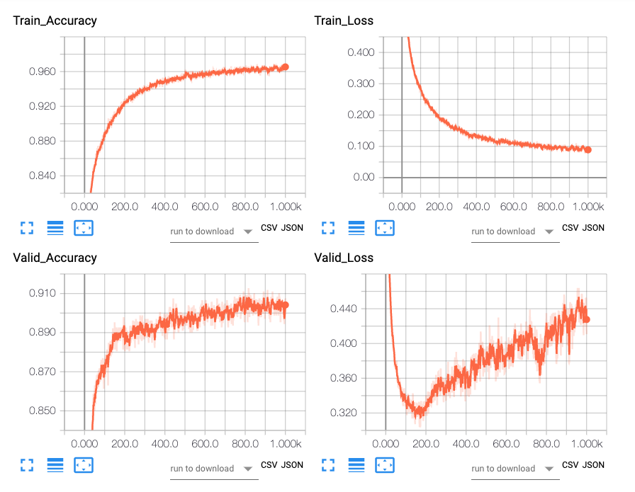

1000번 Epoch을 돌리는데 총 2분이 소요되었다. Accuracy의 대략적인 추세를 보면 모델은 state-action의 관계를 잘 캡쳐한 것처럼 보인다. 하지만 Train_Accuracy와 Valid_Accuracy간의 격차, 그리고 Valid_Loss 커브를 보면 대략 200번째 Epoch 이후로 오버피팅이 시작되는 것이 보인다.

시드를 녹화에 사용한 77번으로 고정하고 플레이를 해본다.


BC 에이전트가 내 행동과 상당히 비슷하게 움직인다. 시드 77은 시작하자마자 왼편이 빈다. 빠르게 왼쪽으로 빠져서 공이 지나가길 기다렸다가 외곽으로 빠지면서 시계방향으로 플레이했다. 에이전트도 비슷한 행동을 한다. 재밌는 점은, 가끔 실수로 죽어서 환경이 재시작하면 오른쪽으로 실수로 움직였다가 왼쪽으로 이동하곤 했는데, 에이전트는 이 실수까지도 모방했다. 실수로 인해 에이전트가 죽지 않았기 때문인지 데이터셋에서 제외되지 않았다.

시드값을 고정하지 않아도 어느정도 잘 플레이할 수 있을까? 시드값을 77로 둔 것과 1~10까지 둔 10판의 평균 점수를 비교해보자.

- 시드 77: 53.130
- 시드 랜덤: 16.490

경험해보지 못한 시드에 대해서는 매우 성능이 떨어짐을 알 수 있다. 플레이를 살펴보니, 왼편에 길이 없음에도 불구하고 시작하면 무조건 왼편으로 뛰어드는 행동을 한다. 즉, "공이 없는 방향으로 이동해야 한다"를 학습한 것이라기 보다는 전문가 플레이 자체를 모방하는데 집중한 것이다.

<br>

## 2. Mirroring User habits

그렇다면 (당연하지만) 전문가 플레이 스타일이 달라지면 BC 에이전트의 플레이 스타일도 달라질까? 이를 위해 와이프를 초빙해서 플레이를 녹화했다. 계속 오른쪽으로 돌기만 했던 나와는 달리 와이프는 다양한 방법으로 움직였다. 초반에도 무조건 왼쪽으로 가기보다는 위로 빠져나가기도 했는데, 학습한 에이전트의 움직임에 이런 특징이 드러난다.

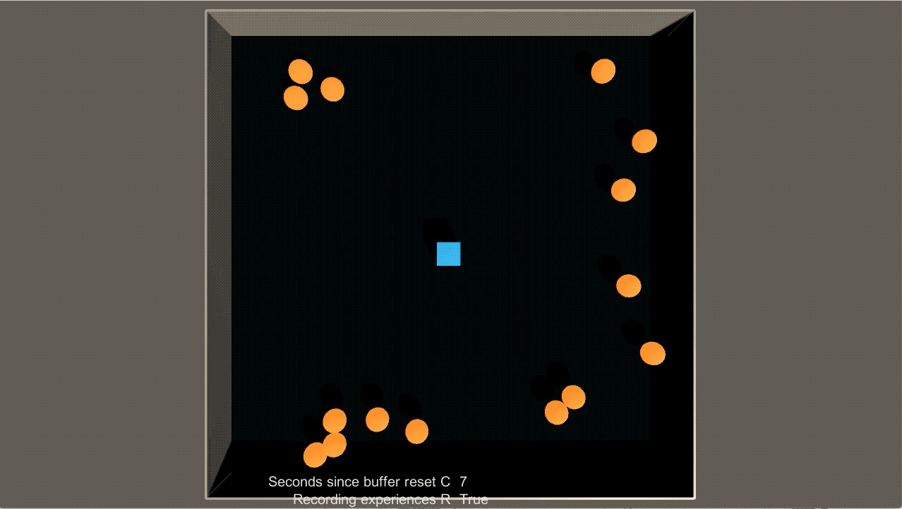

실제로 고정된 시드 77에서는 6.9점이 나왔지만 변동 시드에서는 11.56점이 나왔다. 다양한 방식으로 플레이 녹화를 진행했기 때문인듯 하다.

학습 정확도를 비교해보면 더 다양한 플레이를 한 와이프의 기록(붉은 선)이 Train, Valid Accuracy가 모두 낮은 것을 알 수 있다. 고정된 seed로 인해 주어진 상황이 동일해도 다른 action을 수행하면 당연히 예측 정확도는 떨어질 수 밖에 없다.

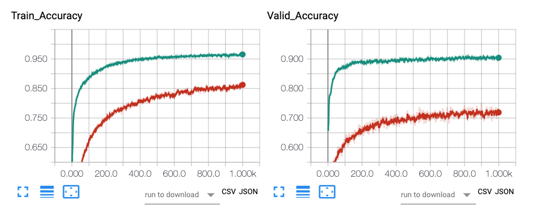

이번에도 BC로 학습하는데 2분 정도가 소요되었다. 어느정도 사람의 플레이 패턴과 습관을 모방하는 결과가 나오는 것으로 보아, 이를 활용한 게임이나 대회같은 것도 나올 수 있지 않을까 하는 생각도 든다.

<br>

## 3. State Augmentation

학습에 사용한 전문가 플레이 데이터셋의 크기가 작아 오버피팅이 날 가능성이 높다. 이를 방지하기 위해서 policy 네트워크에 dropout을 추가했다. 그런데 Train Accuracy가 Valid Accuracy보다 5 ~ 10% 가량 더 높게 형성되었으며, Valid Loss가 어느 순간 치솟기 시작하는 것을 막을 수 없었다.

다른 방법으로 오버피팅을 막아보면 어떨까? 가장 쉬운 방법은 플레이를 더 오래해서 데이터를 늘리는 것이지만 노동력이 들어가기 때문에 그다지 좋은 방법은 아니다. 그렇다면 확보한 데이터를 Augment해서 데이터가 가진 경우의 수를 늘려보면 어떨까? 이미지 분류 모델을 학습할 때는 랜덤으로 좌우 반전, 상하 반전을 주는 간단한 방식으로 데이터를 Augment하는 전략을 취한다.

Dodge 게임은 정사각형의 보드판에서 이루어지는 게임이다. action이 상하좌우이기 때문에 state가 그에 맞추어 상하좌우로만 바뀌면 상관없다. 즉, 랜덤 좌우 반전, 랜덤 상하 반전으로 state를 augment하는 것이 가능하다.

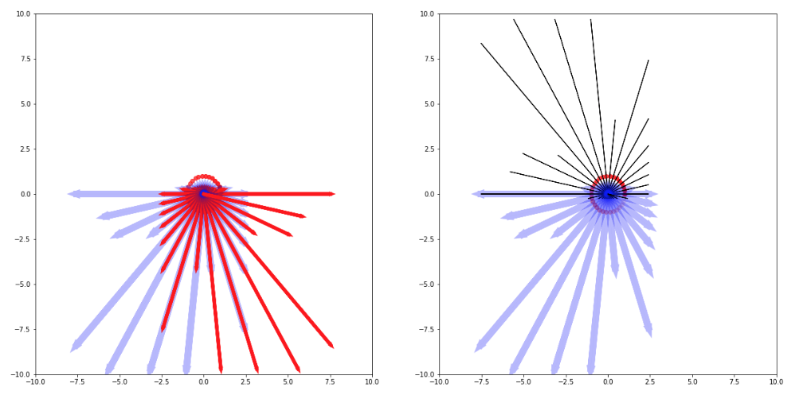

왼편은 좌우 반전, 오른편은 상하반전을 했을 때 각 ray가 반환하는 장애물까지의 거리를 시각화한 것이다. 각도가 맞지 않는 관계로 90도 이동은 하지 않는다.

또는 학습 이미지에 가우시안 노이즈를 더하는 것처럼 거리 벡터에 작은 노이즈를 더해보면 어떨까? 거시적인 장애물의 배치는 비슷하지만 조금씩 다른 state를 여럿 만들어내어 다양한 환경에 더 잘 대처할 수 있지 않을까?

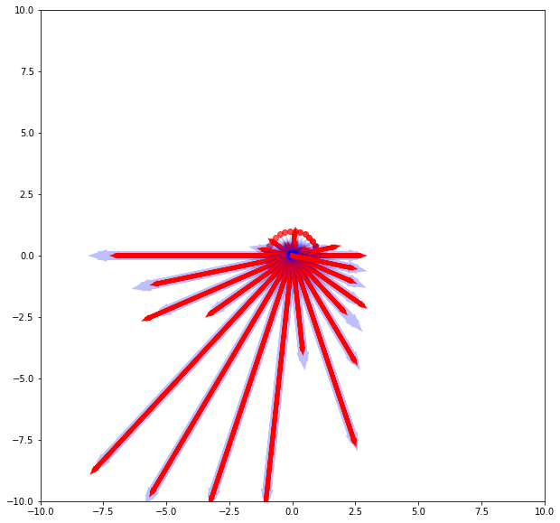

기본 state(파란선)에 `np.random.normal(scale=0.5)`를 더해주면(붉은선) state가 조금씩 달라진다.

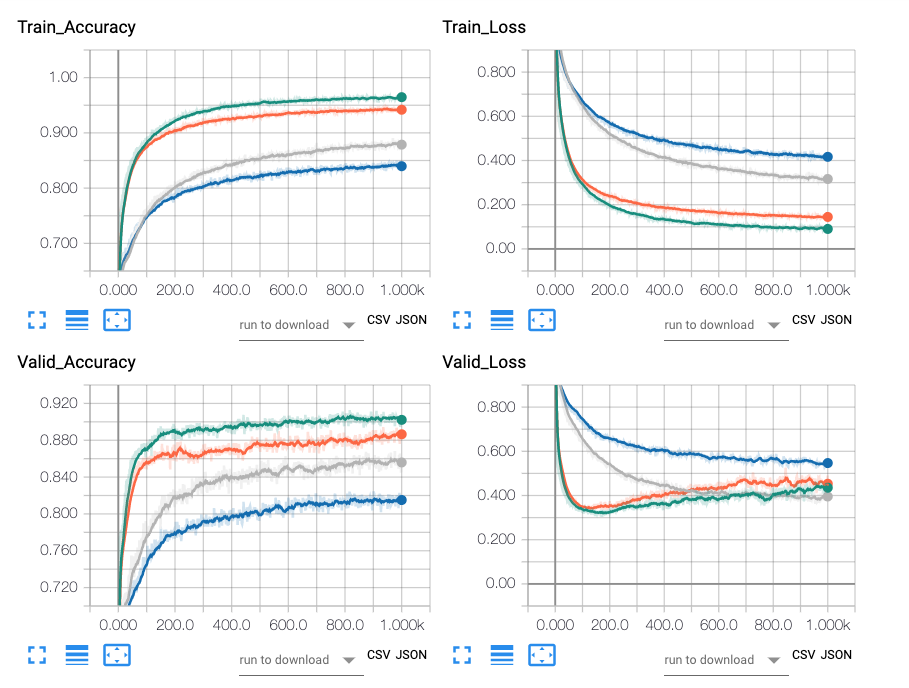

| Dodge Leaderboard   	| 고정 seed 10판 	| 변동 seed 10판 	| 변동 seed 100판 	|
|---------------------	|----------------	|----------------	|-----------------	|
| BC:Default(녹)      	| 53.1           	| 16.4           	| 15.5            	|
| BC:RandomFlip(회색) 	| 35.3           	| 10.8           	| 15.2            	|
| BC:AddNoise(주황)   	| 64.0           	| 29.0           	| 19.7            	|
| BC:All(파랑)        	| 33.5           	| 18.2           	| 14.5            	|

상하좌우 반전을 한 것보다 약간의 가우시안 노이즈를 섞은 모델이 고정/변동 모든 게임에서 가장 좋은 성능을 보였다. 상하좌우 반전을 섞은 에이전트는 왼편 뿐 아니라 오른편으로도 이동하는 모습을 보였지만, 90도 회전이 포함되어 있지 않기 때문에 위아래로는 이동하지 않았으며, 전반적으로는 augmentation을 사용하지 않은 기본 모델과 비슷한 성능을 기록했다. 가우시안 노이즈를 조금 준 것 만으로도 성능이 좋아진 점이 인상적이다.

<br>

## 4. BC vs. DQN

이번에는 Sokoban에 사용했던 DQN을 그대로 사용해서 Dodge 문제를 풀어보자. 전문가 플레이 기록 없이 맨땅에 헤딩하면서 배우는 DQN 에이전트는 어떤 성능을 보일까? DQN에서는 시드고정을 하지 않고 다양한 환경에서 학습했다.

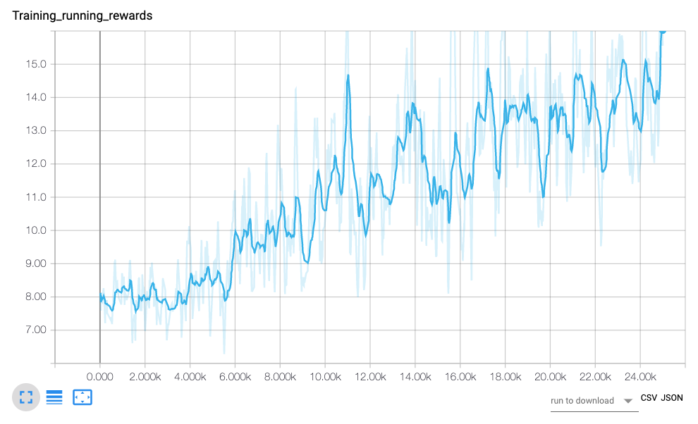

DQN 에이전트는 25,000번 학습을 수행하는데 약 5시간 정도 소요되었다. 100개 episode의 평균 reward 추세를 보면 우상향하는 것으로 보아 학습이 잘 진행된 듯 하지만, y축을 보면 점수가 그다지 높지 않다는 것을 알 수 있다.

epsilon을 0.05로 플레이한 결과를 살펴보자.


시드 77번 문제에서 DQN 에이전트는 편한 왼쪽 길을 놔두고 우상단 좁은 틈새로 이동한다. 그리고 장애물이 덮칠때까지 구석에서 움직이지 않는다. 타임 스텝마다 0.1의 보상을 받기 때문에 최대한 구석으로 들어가서 버티는 것이 제일 좋은 선택이라고 생각한 듯 하다.

전문가 입장에서 가장 좋은 전략은 구석으로 이동한 후 공이 지나가길 기다렸다가 다음 구석으로 빠르게 이동하는 것인데, 이를 실행하려면 타이밍도 중요할 뿐더러 약 30~40번 정도 같은 움직임을 계획적으로 반복해야 한다. DQN 에이전트는 그러한 전략적 움직임까지는 학습하지 못했다.

| Dodge Leaderboard 	| 고정 seed 10판 	| 변동 seed 10판 	| 변동 seed 100판 	|
|-------------------	|----------------	|----------------	|-----------------	|
| BC:Default        	| 53.1           	| 16.4           	| 15.5            	|
| BC:RandomFlip     	| 35.3           	| 10.8           	| 15.2            	|
| BC:AddNoise       	| 64.0           	| 29.0           	| 19.7            	|
| BC:All            	| 33.5           	| 18.2           	| 14.5            	|
| DQN:Default       	| 14.9           	| 12.0           	| 7.4             	|

여러 실험 조건에서 봐도 DQN은 BC 에이전트들에 비해 성능이 비교적 떨어지는 것으로 드러났다. DQN이 모든 문제를 잘 풀 수 없다는 점, 사람의 가이드를 활용한 BC가 때로는 더 효율적이라는 점을 알 수 있다.

<br>

## 5. DQN Transfer Learning with BC

동일한 인풋 state에 대해 BC는 각 액션의 logit으로 action의 선택 확률을 뽑아내고, DQN은 각 액션의 value를 추정한다. 개념이 약간 다르지만, 선택 확률과 가치가 양의 관계를 갖는다고 가정하면.. BC로 빠르게 학습한 모델을 DQN 모델의 초기값으로 사용할 수 있지 않을까? 그러면 초반 구간을 빠르게 넘어가서 더 높은 점수를 기록하는 모델을 만들 수 있을지도 모른다.

실험 3에서 결과가 가장 좋았던 BC:AddGausianNoise의 모델을 불러오고 DQN epsilon을 0.7로 두어 20,000번 학습했다.

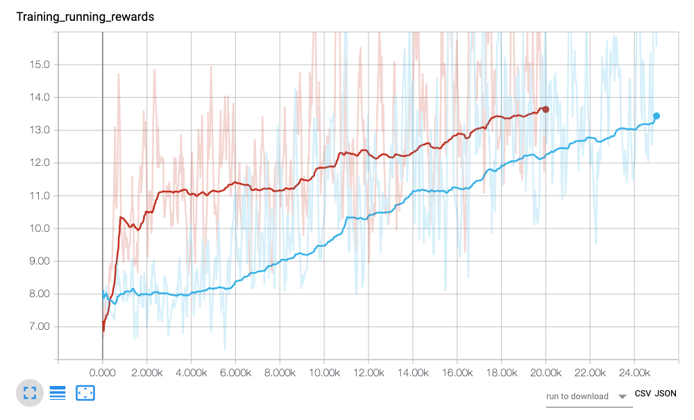

실험 결과 BC로 초기값을 설정한 DQN(붉은선)이 기본 DQN에 비해 가파른 초반 성장세를 보인다. 덕분에 이 에이전트는 기존 에이전트의 최고 지점을 약 5천 Epoch 정도 빠르게 도달했다. 그러나 도달한 점수를 보면 Dodge를 더 잘 풀어내는 에이전트가 나왔다고는 보기 어렵다.

| Dodge Leaderboard 	| 고정 seed 10판 	| 변동 seed 10판 	| 변동 seed 100판 	|
|-------------------	|----------------	|----------------	|-----------------	|
| BC:Default        	| 53.1           	| 16.4           	| 15.5            	|
| BC:RandomFlip     	| 35.3           	| 10.8           	| 15.2            	|
| BC:AddNoise       	| 64.0           	| 29.0           	| 19.7            	|
| BC:All            	| 33.5           	| 18.2           	| 14.5            	|
| DQN:Default       	| 14.9           	| 12.0           	| 7.4             	|
| DQN:BC            	| 30.3           	| 19.7           	| 17.8            	|

플레이 테스트 결과를 보면 DQN:BC는 기존 DQN에 비해 조금 더 나은 성능을 보였고, 변동 플레이 테스트에서도 다른 BC와 비슷한 성능을 보였다.

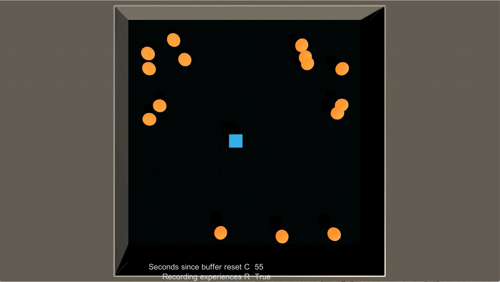

플레이 영상에서는 BC 에이전트와 비슷한 방식으로 움직이는 모습이 포착되기도 했다.

결론적으로 BC 모델을 DQN 모델의 초기값으로 사용하는 것은 초반 학습 과정을 더 쉽게 해주는 이점은 있었으나, 기본 DQN 모델이나 BC 모델을 뛰어넘는 결과를 기록하지는 못했다. DQN보다는 BC처럼 확률을 직접적으로 추정하는 policy-based model을 써봤으면 어땠을까 싶다.

<br>

## 6. Dodge2

마지막으로 예제 코드를 간단히 수정해서 필드 위에 +1 보상을 주는 요소를 추가해 보았다.

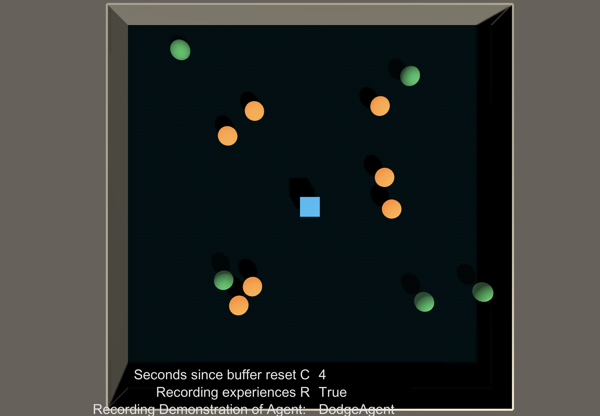

기존 Dodge에서는 에이전트를 중심으로 30개의 광선을 쏴서 제일 처음 맞는 장애물이나 벽까지의 거리를 리턴한다. 이때는 장애물이나 벽 외에는 다른 사물이 없었기 때문에, 광선이 어떤 물체에 맞는지를 분간할 필요가 없었다. 그런데 보상이 추가되면서, 보상과의 거리를 장애물과의 거리와 구분해야 하기 때문에, 광선 30개 세트를 따로 만든 후 `LayerMask` 를 이용해서 광선이 탐지하는 물체를 지정했다.

```c#
// 골에만 쏘는 ray
List<Vector3> debugGoalRay = new List<Vector3>();
int goalLayerMask = 1 << LayerMask.NameToLayer("Goals");
for(float i = 0; i < raycount; i++)
{
    Angle = i * 2.0f * Mathf.PI / raycount;
    goalRay = new Ray(this.transform.position, new Vector3(Mathf.Cos(Angle), 0, Mathf.Sin(Angle)));

    if(Physics.Raycast(goalRay, out goalHit, Mathf.Infinity, goalLayerMask))
    {
        AddVectorObs(goalHit.distance);
        debugGoalRay.Add(goalHit.point);
            
    }
    else
    {
				// 광선이 맞지 않는 경우, 필드의 최대값인 10.0을 전달한다.
        AddVectorObs(10f);
        debugGoalRay.Add(goalRay.origin);
    }
}
```

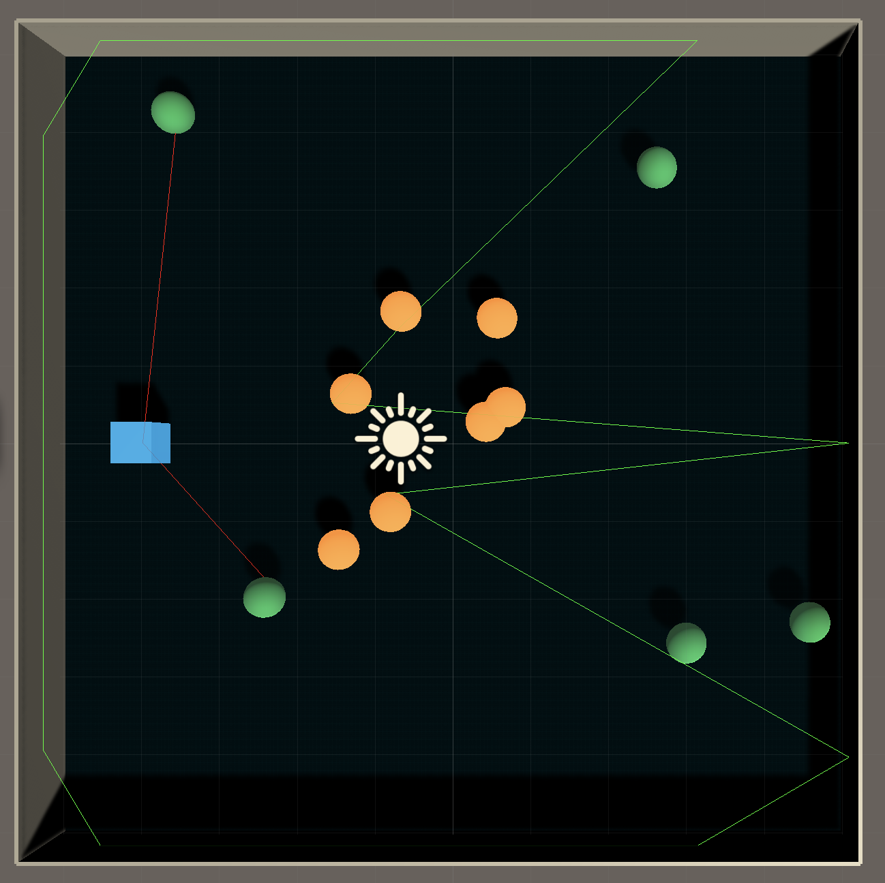

이로서 두개의 광선이 장애물(오렌지공, 벽)과 보상(녹색공)을 따로 따로 탐지한다. 위 그림에서 멀리 있는 보상 공은 탐지가 안되는데, 이는 공들이 광선 사이에 위치했기 때문이다.

100초 가량의 전문가 플레이를 녹화한 후 기본 BC 알고리즘을 이용해 학습하면 아래와 같이 사람처럼 움직이는 에이전트를 얻을 수 있다.


<br>

# Outro

이번 포스팅에서는 사람의 플레이를 모방한 BC 에이전트로 Dodge 게임을 플레이 해보았다. BC는 환경과의 인터랙션 정보에 의존하지 않고 전문가 플레이를 모방하기 때문에 개발 난이도도 낮았으며 학습 시간도 매우 짧았다. 그리고 무엇보다 강화학습(DQN) 에이전트에 비해 더 나은 성능을 보였다.

그럼에도 불구하고 BC는 주어지지 않은 새로운 상황에 제대로 대처하지 못하는 문제가 있었다. 에이전트의 위치와 공들의 위치가 만들어낼 수 있는 상태 조합은 무한한데 반해, 주어진 100초 남짓의 전문가 플레이 데이터는 매우 한정적이다. 시드를 고정한 게임에서는 성능이 좋았지만, 시간이 흐름에 따라 에이전트와 환경이 만들어내는 상태가 플레이 데이터와 달라지면서 한계를 맞았다. 변동 시드 게임에서는 처음부터 고전했다.

이를 해결하기 위해 Dodge 게임의 특징에 착안한 데이터 augmentation을 해보았다. 상하좌우 반전을 무작위로 섞은 경우 학습-검증간 오버피팅을 크게 줄일 수 있었지만, 테스트 플레이에서는 별로 도움이 되지 않았다. 가우시안 노이즈를 살짝 섞은 경우에는 오버피팅 패턴은 거의 비슷했지만 변동 테스트에서 약간의 성능 개선을 볼 수 있었다. 그러나 어떤 경우에도 한단계 업그레이드된 방식으로 게임을 플레이했다고 보기는 어려웠다. 조금씩 변화를 준다고 해서 커버할 수 있는 경우의 수가 크게 늘어나지는 않았던 듯 싶다. 책에 나왔듯 더 많은 전문가 플레이를 모으는 방법이 변동 시드 게임에서 성능을 높일 수 있는 방법일 듯 하다.

BC의 한계점은 에이전트와 환경의 연속적인 진행이 만들어내는 다채로운 변화를 플레이 데이터가 커버할 수 없다는 것에 있었다. 최근에 나오는 GAIL, VAIL 등 Imitation Learning을 통해 BC보다 더 나은 에이전트를 학습시킬 수 있을지 테스트 해봐야겠다.

<br>

# Reference

- 텐서플로와 유니티 ML-Agents로 배우는 강화학습
- https://dallcom-forever2620.tistory.com/18