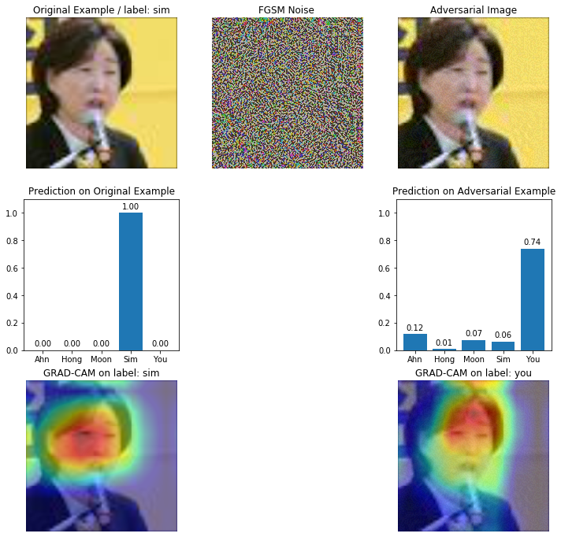
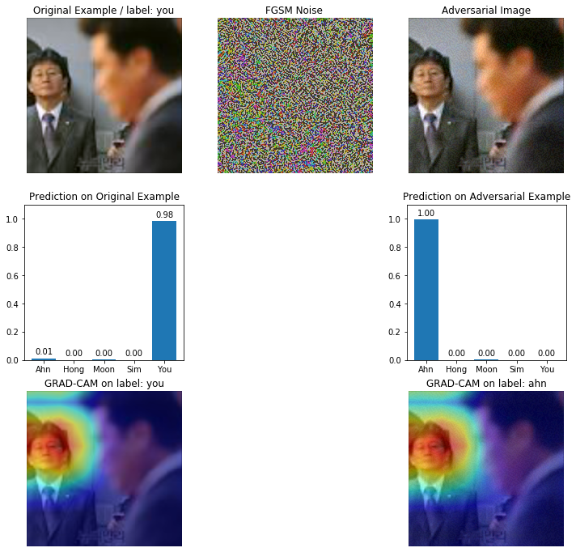
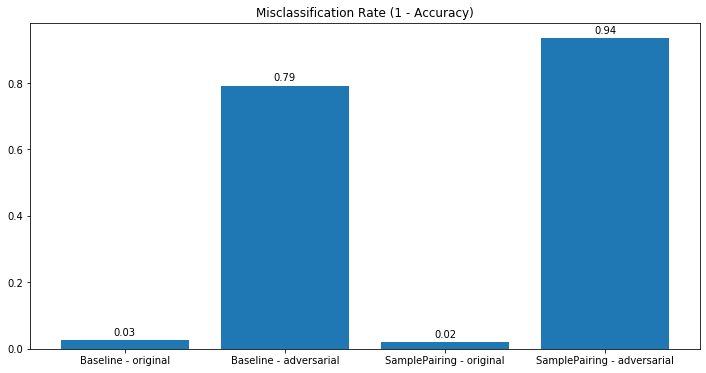
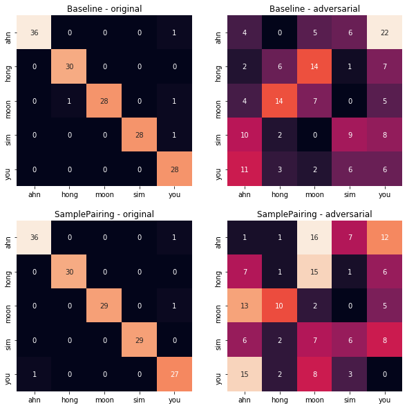
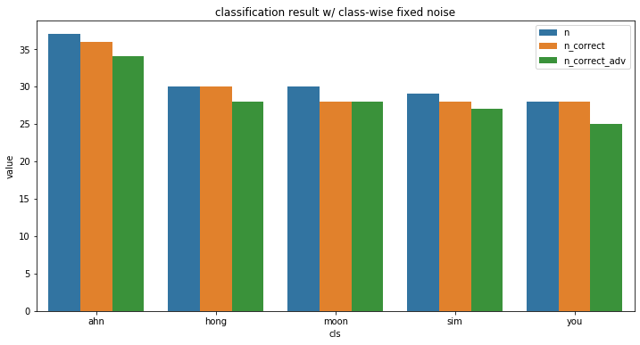
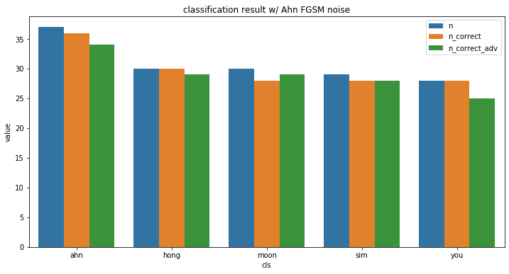
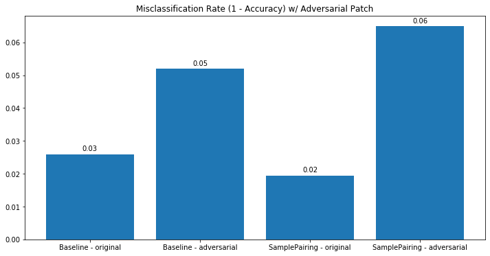
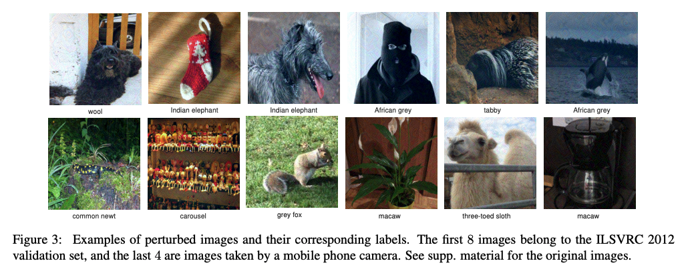
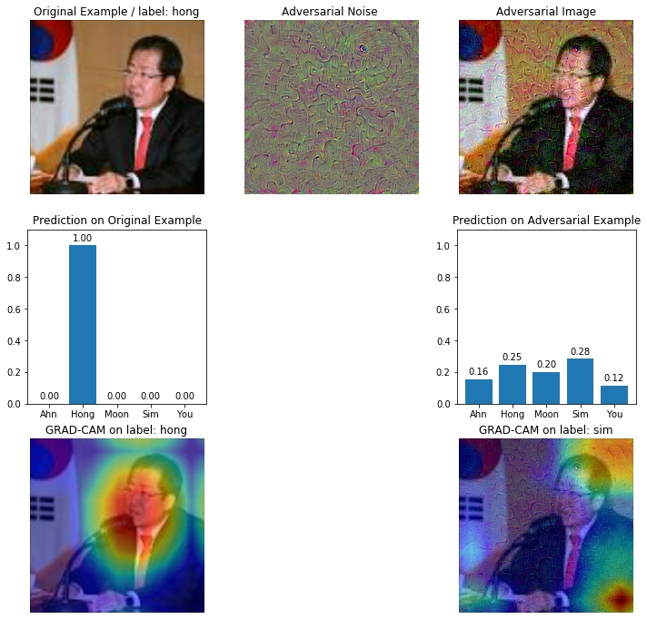
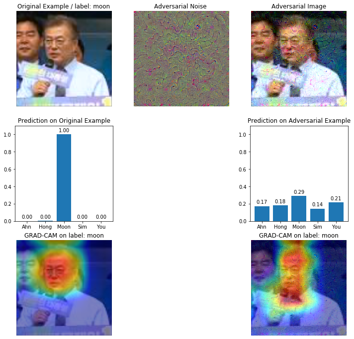

# Intro

이미지 분류 문제는 더이상 흥미로운 화젯거리가 되지 못하나보다. 2015년 ResNet이 나오면서 처음으로 사람의 인지 수준보다 더 정확하게 1000개 이미지를 분류하는 성과를 냈다. 이후에도 SeNet 등 새로운 아이디어가 나오긴 했지만, 더이상 어려운 문제가 아니라 그런지 2017년을 마지막으로 더이상 공식 대회는 열리지 않는다.

PyTorch나 Tensorflow 등에 탑재된 ImageNet pretrained 모델을 사용하면 새로운 데이터도 매우 높은 정확도로 쉽게 분류할 수 있다. 이전에 내가 구글에서 크롤링한 천여장의 2016 대선주자 5인의 얼굴도 대략 97.5%의 정확도로 분류할 수 있었다.

더 흥미로운 점은, 이 딥러닝 모델들이 우리가 이미지를 이해하듯 판단한다는 것이다. 여러 방법 중 Grad-CAM을 이용하면 모델이 생각한 정답에 반응한 영역을 히트맵으로 시각화할 수 있다. 그 결과 아래 그림처럼 사람의 얼굴을 보고 분류를 수행했다는 것을 알 수 있다. 아주 완벽하지는 않지만 적당히 각 사람의 얼굴이나 특징에 히트맵이 쳐져 있다.


분류 결과와 히트맵을 보면 정량적 & 정성적으로 이 모델에 믿음이 간다. 그런데 정말 믿어도 되는걸까? 

<a href="https://en.wikipedia.org/wiki/Adversarial_machine_learning">Adversarial Attack</a>은 입력 데이터에 악의적 조작을 가해서 학습된 모델이 제대로 동작하지 못하게 하는 머신러닝 분야다. 힘들게 학습한 모델을 왜 공격할까 싶기도 하지만, 보안 기술은 그 경쟁 상대인 해킹 기술과 더불어 발전하는 법. 이번 포스팅에서는 이 Adversarial Attack 분야에서 제안된 몇가지 아이디어를 간단히 정리하고 대선주자 이미지 데이터셋을 이용해 실험한 결과를 정리해보았다.

<br>

# Fast Gradient Sign Method

Fast Gradient Sign Method(FGSM)은 GAN으로 유명한 Ian Goodfellow가 참여하여 2015년에 발표한 논문 <a href="https://arxiv.org/abs/1412.6572">Explaining and Harnessing Adversarial Examples</a>에서 제안된 기법이다. 

원본 이미지를 $x$라 하면 여기에 조작(perturbation)을 $\eta$ 만큼 가한 이미지를 $\widetilde{x}$라 한다. 

$\widetilde{x} = x + \eta$

$\eta$ 에 조건이 하나 붙는다. $\|\| \eta \|\|_ {\inf} < \epsilon$, 즉 max-norm이 아주 작은 값 $\epsilon$ 보다 작아야 한다. Adversarial Attack이 성공하기 위해서는 모델은 완전히 다르게 반응하나 육안(혹은 관측 센서)으로 봤을 때는 이미지가 별로 달라지지 않아야 한다. 

임계값을 넘지 않으면서도 모델에 영향을 주는 $\eta$ 는 다음과 같이 구한다.

$\eta = \epsilon \text{sign}(\triangledown_x J(\theta, x, y))$

학습된 모델 $\theta$ 를 이용해서 정답 레이블 $y$ 에 대한 입력 이미지 $x$ 의 gradient를 구한다. 여기에 sign 함수를 이용해 부호를 취한다음 임계값 $\epsilon$ 을 곱해주면 적절한 조작값 $\eta$가 만들어진다. 그리고 위 식처럼 $\widetilde{x} = x + \eta$ 를 통해 모델을 속이는 Adversarial Examples를 생성할 수 있다. 

분류 모델을 학습할 때는 데이터는 고정시켜 둔 상태에서 모델의 파라미터를 바꿔가면서 예측 비용이 가장 **낮아지는** 지점을 찾는다. FGSM에서는 모델은 이미 학습이 끝난 상태이므로 파라미터가 고정되고 데이터에 조작을 가한다. 그리고 예측 비용이 가장 **높아지는** 방향, 즉 모델이 최대한 오답을 내도록 이미지를 변형한다. 보다 더 자세한 설명은 <a href="https://leedakyeong.tistory.com/entry/논문-FGSM-리뷰-EXPLAINING-AND-HARNESSING-ADVERSARIAL-EXAMPLES">논문-FGSM-리뷰</a> 에 아주 잘 정리되어 있다.

PyTorch로는 다음과 같이 구현할 수 있다.

```python
# model을 불러온다.
net = load_model(model_weight_path)
net.eval()

# 조작을 가할 이미지를 가져온다.
img_tensor, label = test_loader.dataset[30]

# batch 차원이 있는 텐서로 변환한다. (1, 3, 197, 197)
img_batch = img_tensor.unsqueeze(0)
label_batch = torch.LongTensor([label])

# 입력 이미지의 gradient를 구해야 하므로 requires_grad를 True로 설정한다.
img_batch.requires_grad = True

# 분류 결과를 얻는다.
logits = net(img_batch)
probs = F.softmax(logits, dim=1)[0]

# 비용을 계산하고
# backpropagation을 실행한다.
cost_fn = nn.CrossEntropyLoss()
cost = cost_fn(logits, label_batch)
cost.backward()

# 비용에 대한 원본 이미지의 gradient를 구한다.
grad = img_batch.grad.detach()[0] # batch 차원을 없앤다.
signed_grad = torch.sign(grad) # 부호만 살린다.
epsilon = .1
eta = epsilon * signed_grad

# 원본 이미지에 perturbation을 가해 Adversarial Example을 만든다.
img_hat_tensor = img_tensor + eta
```

원본 이미지와 조작하는 signed_grad, 그리고 조작한 이미지를 시각화해보면 다음과 같다.


노이즈가 자글자글해 보이지만, 여기에 epsilon 0.1을 곱하고 원본 이미지에 더했기 때문에 조작된 이미지는 원본과 크게 달라보이지 않는다. 적어도 육안으로는 동일 인물로 보인다.

<br>

# FGSM Experiments

이전에 학습해둔 대선주자 이미지 분류 모델을 이용해 실험을 진행해보자. 대선주자 5인의 사진 1300 장으로 이미지넷 pretrained 모델을 finetuning하여 test accuracy 97%에 도달한 모델이다. 

## 1. FGSM 노이즈가 개별 이미지 분류 성능에 영향을 줄까?


엄청 큰 영향을 줬다. 원본과 조작된 이미지는 거의 차이가 없으며 육안으로는 명백히 동일한 사람으로 보인다. 그럼에도 불구하고 모델의 판단 결과는 100% ahn에서 88% you으로 급격하게 바뀌었다. 






다른 이미지에 대해서도 비슷한 결과가 나왔다. 노이즈로 인해 사람 자체가 바뀐 것이 아님에도 불구하고 모델의 예측 결과가 크게 달라졌다. 흥미로운 점은 Grad-CAM을 이용해 예측 확률이 가장 높은 레이블에 대해 반응한 영역을 뽑아보면 둘 다 비슷하게 얼굴을 가리킨다는 점이다. Grad-CAM의 히트맵을 보고 모델이 사람과 비슷하게 얼굴의 특징적인 영역을 보고 판단하므로 그 예측 능력을 신뢰할 수 있다고 평가했다. 그러나 육안으로는 어떤 의미를 찾기 어려운 노이즈에 분류 결과가 바뀌는 것을 보면 모델의 성능을 여전히 신뢰할 수 있을지 의문이 든다.


## 2. 전체 분류 성능은 어떨까?

이전 포스팅 <a href="https://jsideas.net/samplepairing/">SamplePairing on Small Dataset</a> 에서 일반적인 data augmentation을 사용한 Baseline 모델과 Sample Pairing을 사용한 모델을 만들었다. SamplePairing은 무작위로 두 이미지를 섞어서 학습에 사용한다.


SamplePairing 모델은 기존 Baseline 모델에 비해 더 강력한 노이즈를 사용하여 더 나은 테스트 성능을 기록했다. 그렇다면 이 모델이 노이즈가 첨가된 Adversarial Attack에 대해서도 더 잘 버틸 수 있을까? 테스트 데이터를 이용해서 오분류율( 1 - 정확도)를 계산해보았다.  



정상 테스트 이미지에 대해서는 SamplePairing의 오분류율은 2%로 Baseline 모델에 비해 1% 더 높았으나, Adversarial Examples에 대해서는 오히려 오분류율이 높아졌다. 전체 중 94%의 이미지를 제대로 분류하지 못했다. 즉, 더 나은 테스트 성능이 Adversarial Attack에 대한 강건함을 의미하지 않았다. 이는 다른 Adversarial Attack 논문들에서 테스트해본 내용과 비슷하다. 



Confusion Matrix를 보면 모델별로 Adversarial Examples에 당하는 패턴이 동일하지 않다는 것이 보인다. Baseline 모델은 대체로 ahn를 you으로 예측한데 반해, SamplePairing 모델은 moon / you으로 예측했다. 다른 클래스에서도 비슷한 패턴이 발견되지는 않았다.


## 3. 클래스별로 노이즈를 고정시켜도 공격이 성공할까?

클래스별로 무작위로 이미지를 고른 후, 그 이미지에 대한 Noise를 생성한다. 그리고 그 Noise를 해당 클래스에 적용하여 공격이 성공하는지 살펴보았다.



원본 테스트 이미지에 대한 분류 성공 횟수(n_correct)와 고정된 노이즈를 이용한 결과(n_correct_adv)가 거의 비슷하게 나왔다. 즉, 개별 이미지의 노이즈를 같은 클래스의 다른 이미지에 적용해도 분류 모델을 방해하지 못했다.

다른 클래스의 노이즈를 적용하면 어떻게 될까? ahn 이미지 1장으로 뽑은 노이즈를 전체 데이터에 적용해보자.



별 차이가 없는 것으로 보아 FGSM 노이즈는 추출한 대상 이미지에만 효과적으로 동작한다고 볼 수 있다.

<br>

# Adversarial Patch

이번에는 2017년 논문 <a href="https://arxiv.org/pdf/1712.09665.pdf">Adversarial Patch</a> 에서 제안한 Adversarial Patch를 이용해서 공격을 시도해보자. 이 논문에서 만든 Patch를 대상 이미지에 붙이면 분류 모델의 출력에 혼동을 주는 효과를 얻을 수 있다고 한다. 앞에서 시도한 FGSM은 공격하려는 대상 이미지와 그 정답 정보를 알고 있는 상태에서만 유효했다. 논문에서 주장하는 바에 따르면 Adversarial Patch는 공격 대상이 되는 이미지에 담긴 정보나, Adversarial 패치의 크기나 위치에 관계없이 신경망에 혼선을 줄 수 있다고 한다. 


저 작은 패치를 붙인 것만으로도 banana를 toaster로 분류했다. 

실제로 잘 될까? 구글에서 바나나 이미지를 하나 내려받고 여기에 스티커를 붙인다. 그리고 ImageNet 데이터셋으로 학습해 둔 pretrained ResNet50에 넣어 예측 결과를 비교해보자.


바나나가 조금 가리기는 했지만 패치를 붙인 것 만으로 결과가 크게 달라졌다. 

이 스티커를 그대로 대선주자 얼굴에 붙였을 때도 비슷한 효과를 얻을 수 있을까? 이미지 좌측 하단에 패치를 붙인 후 FGSM과 동일한 방식으로 비교해보았다.


실망스럽게도 얼굴 이미지에 대해서는 패치가 제대로 동작하지 않는다. Grad-CAM 히트맵을 보면 모델이 패치에는 전혀 눈길도 주지 않는다는 것을 알 수 있다. (물론 이 포스팅에서는 Grad-CAM 결과를 곧이곧대로 해석하기는 어려워 보인다.)

전체 테스트 이미지에 대한 오분류율을 보면 거의 효과가 없었음이 드러난다.



<br>

# Universal Adversarial Perturbation

Adversarial Perturbation은 바나나를 토스터로 둔갑시켰지만 대선주자 이미지에 대한 공격에는 실패했다. FGSM은 대선주자 이미지 공격에 성공했지만, 공격 대상 이미지마다 노이즈를 생성해줘야 하는 문제가 있었다. 입력 데이터에 관계 없이 신경망에 혼선을 주는 Universal한 Adversarial Examples를 생성할 수는 없을까? 2016년 발표된 논문 <a href="https://arxiv.org/pdf/1610.08401v3.pdf">Universal Adversarial Perturbation</a>은 데이터 포인트가 해당 클래스의 결정 경계를 벗어나는 최소한의 벡터를 찾는 방식을 이용해서 모든 데이터에 적용할 수 있는 노이즈 $v$를 생성한다.


UAP 알고리즘은 아래와 같다. 데이터셋을 순회하면서 노이즈를 더한 이미지의 클래스가 정답과 달라질때까지 perturbation $v$ 를 업데이트한다. 이때 7번째 줄은 2015년 논문 <a href="https://arxiv.org/pdf/1511.04599.pdf">DeepFool: a simple and accurate method to fool deep neural networks</a> 에서 제안한 DeepFool을 사용한다. 


 

이를 통해 생성한 노이즈 벡터 $v$ 를 이미지에 넣고 예측하면 정답과 완전히 다른 레이블을 출력한다. 2번째 양말 사진을 모델이 인도 코끼리로 분류했다.

<br>

# Fast Universal Adversarial Perturbation 

Universal Adversarial Perturbation(UAP)을 이용해 대선주자 훈련 데이터셋으로 노이즈를 생성하려 했으나, 학습 시간이 좀 오래 걸리는 문제가 있었다. 또한 <a href="https://github.com/ferjad/Universal_Adversarial_Perturbation_pytorch">ferjad의 구현체</a> 를 사용해 테스트해보았는데, 목표 오분류율 80%에 도달하지 못하고 50%대 언저리에서 학습이 종료되었다. UAP의 아이디어를 조금 더 발전시킨 논문이 2019년 나온 <a href="https://arxiv.org/pdf/1911.01172v3.pdf">Fast-UAP: An Algorithm for Speeding up Universal Adversarial Perturbation Generation with Orientation of Perturbation Vectors</a> 다. Fast-UAP는 여러 $v_i$ 중에서 현재 노이즈 벡터 $v$ 와 가장 코사인 유사도가 높은, 즉 방향이 비슷한 $v_i$ 를 선택하여 학습한다. (13번째 줄)


Fast-UAP는 UAP에 비해서 오분류율이 높은 노이즈를 더 빨리 생성할 수 있다.


DeepFool 구현체를 참조하여 13번째 줄 로직을 구현하고 대선주자 훈련 데이터셋을 대상으로 노이즈를 학습한 결과, 약 1시간 40분만에 80% 오분류율을 야기하는 노이즈 벡터 $v$ 를 생성할 수 있었다.


<br>

# Fast-UAP Experiments

## 개별 이미지에 대한 공격 결과

이미지마다 Noise가 다르게 생성되었던 FGSM과 달리 Fast-UAP 실험에서는 모두 동일한 Noise를 사용한다. FGSM은 $\epsilon=0.1$ 을 노이즈 $\eta$ 에 곱해서 더한데 반해, Fast-UAP에서는 생성한 Noise를 그대로 원본 이미지에 더한다. 그래서인지 Fast-UAP의 이미지가 FGSM보다 조금 더 자글자글해 보인다.

분류 결과도 FGSM과는 조금 다르다. FGSM에서는 정답이 아닌 다른 클래스의 분류 확률이 매우 높아졌으나, Fast-UAP에서는 확률이 전체 클래스로 고르게 뿌려지는 경향이 보인다. 여러 클래스의 데이터로 오분류를 일으키는 노이즈를 학습했기 때문에 이런 결과가 나오지 않았을까 싶다.






## 테스트 데이터셋에 대한 분류 성능 비교

FGSM보다는 오분류율이 높지는 않지만 꽤 괜찮은 결과가 나왔다. Fast-UAP로 노이즈를 학습할 때 Baseline 모델을 사용했다. 훈련 데이터셋에 대한 오분류율이 80%에 도달하면 학습을 종료했다. Baseline 모델의 테스트 데이터에 대한 오분류율도 그와 엇비슷한 76%가 나왔다. 흥미로운 점은 모델이 조금 다름에도 불구하고 Baseline으로 만든 노이즈가 SamplePairing 모델에도 53%의 오분류율을 기록했다.

'

Confusion Matrix를 보면 흥미로운 결과가 보인다. FGSM 실험에서는 예측 클래스가 무작위로 흩뿌려진 느낌이었다면, Fast-AUP는 특정 클래스로 몰아주는 경향이 보인다. 베이스라인 모델은 노이즈가 섞인 테스트 이미지들을 거의 대부분 moon으로 예측해버렸다. 구현상 문제가 있었던 걸까.. 의심이 들기도 하지만 어쨌든 Fast-UAP를 이용한 공격은 성공했다고 볼 수 있다.


## Attack on Teachable Machine

Google에서 만들어 공개한 <a href=https://teachablemachine.withgoogle.com/>Teachable Machine</a> 를 이용하면 적은 수의 이미지 데이터로도 분류 모델을 쉽게 만들 수 있다. 여기서 만든 모델에 Fast-UAP로 생성한 노이즈를 입혔을 때 공격이 성공할까?


훈련 데이터셋으로 학습했을 때 테스트셋 오분류율은 18% 정도다. 직접 학습하는 것보다는 성능이 좋지 않지만 클릭 몇 번만으로도 꽤 괜찮은 성능의 분류 모델을 만들었다.

Teachable Machine에서는 모델 저장도 지원한다. 화면 우상단의 Export Model 버튼을 누르면 Tensorflow.js, Lite 등 다양한 형태를 지원한다. 또 이를 바로 실행해볼 수 있는 Keras 코드 스니펫까지 지원한다. h5 파일로 모델을 저장한다음 Keras로 불러와서 원본 테스트셋과 Fast-UAP 노이즈를 입힌 노이즈 테스트셋에 대한 오분류율을 비교해보자.

- 원본 Test Set: 오분류율 0.188
- Fast-UAP Test Set: 오분류율 .714

앞선 실험 결과와 마찬가지로 Fast-UAP가 모델의 판단에 장애를 일으키는데 성공했다. 


Teachable Machine도 노이즈가 더해진 이미지를 제대로 분류하지 못했다. 

<br>

# Outro

이번 포스팅에서는 FGSM, Adversarial Patch, Fast-UAP를 이용해 대선주자 이미지 분류 모델에 대한 Adversarial Attack을 시도해보았다. 공격 대상 이미지에 대한 정보를 훤히 알고 있는 경우에는 구현이 쉽고 생성이 간편한 FGSM이 좋아보인다. 이미지넷 데이터에 있는 사물을 식별하는 모델을 공격할 때는 Adversarial Patch Sticker를 붙이는 것만으로도 효과를 볼 수 있다. 그리고 데이터셋이 준비된 상태에서 그 이미지나 클래스에 관계없이 공격을 하는 경우에는 UAP 혹은 Fast-UAP를 사용하면 좋을 듯 하다.

이번 실험을 하면서 여러가지 복잡한 생각이 교차했다. 나는 그동안 분류 모델의 정확도라는 정량적 지표와 CAM이라는 정성적 결과를 종합해서 학습한 모델을 평가하고 신뢰해왔다. 그런데 육안으로는 잘 보이지도 않는 노이즈에 분류 결과가 뒤바뀌고 Grad-CAM이 제대로 동작하지 않는 걸 보니, 무엇을 믿어야 할지 조금 혼란스럽다. Adversarial Attack 분야의 발전이 Grad-CAM보다 더 나은 해석 방법의 발전으로 이어질 수 있을지 궁금하고 기대가 되기도 한다.

<br>

# Reference

- EXPLAINING AND HARNESSING ADVERSARIAL EXAMPLES
- Adversarial Patch
- DeepFool: a simple and accurate method to fool deep neural networks
- [https://leedakyeong.tistory.com/entry/%EB%85%BC%EB%AC%B8-FGSM-%EB%A6%AC%EB%B7%B0-EXPLAINING-AND-HARNESSING-ADVERSARIAL-EXAMPLES](https://leedakyeong.tistory.com/entry/논문-FGSM-리뷰-EXPLAINING-AND-HARNESSING-ADVERSARIAL-EXAMPLES)
- Fast-UAP: An Algorithm for Speeding up Universal Adversarial Perturbation Generation with Orientation of Perturbation Vectors
- Universal adversarial perturbations