## Intro

아버지가 환갑을 맞으셨다. 세심함과는 거리가 먼 아들이라 그동안에는 매번 작은 용돈으로 생신을 넘겨왔다. 장수가 흔해져 환갑을 더이상 크게 축하하지 않는 것이 요새 트렌드라고는 하지만, 그동안의 무심함을 만회하고자 이번에는 작은 선물을 준비해보았다.

<hr>

## 아버지의 취미: 등산 + 비박 + 사진

아버지는 꽤 오래전부터 사진을 취미로 하고 있다. 이 취미는 그전 취미였던 산행(태백산맥 종주)과 결합되면서 가족들로서는 함께 하기 상당히 어려운 레벨로 진화했다. 한달에 한 두번 아버지는 무거운 카메라 장비를 메고 산에서 비박(bivouac)을 하며 풍경을 렌즈에 담는다.


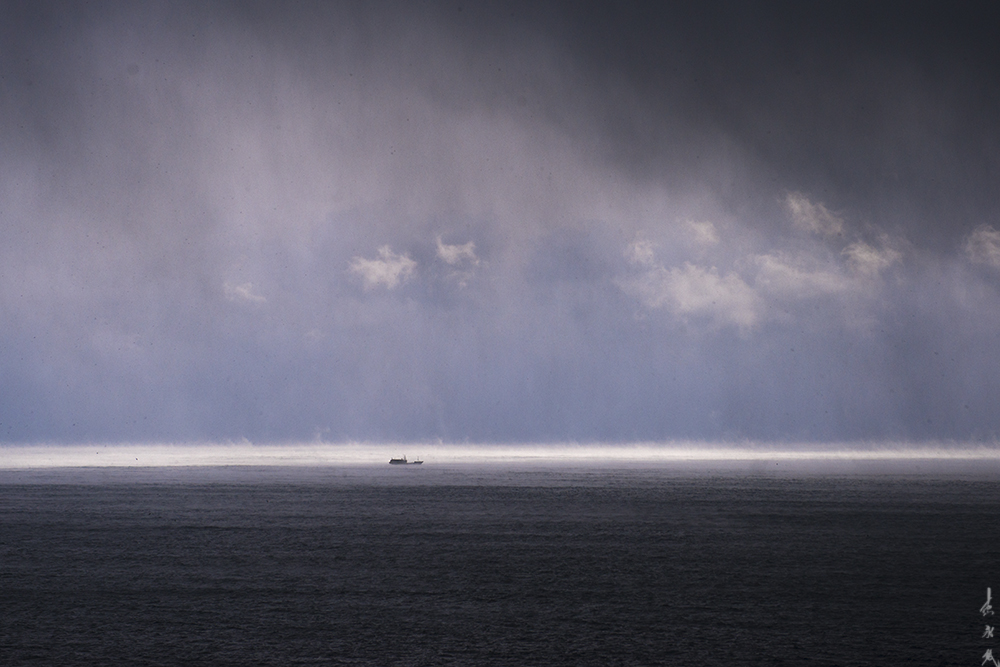

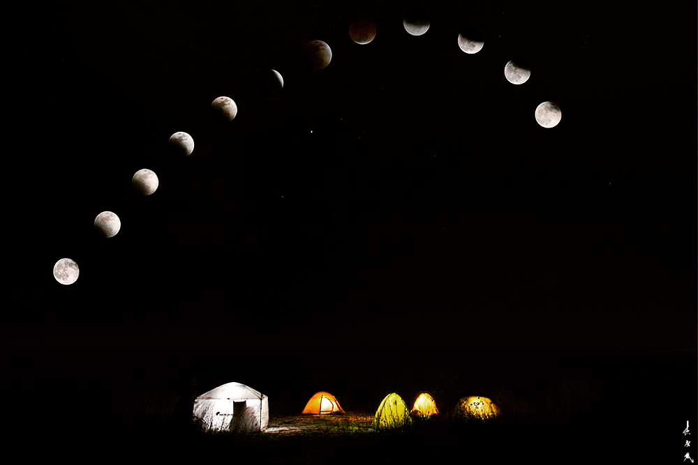

최근에는 조류에 관심을 많이 두시는지 가족 카톡방에는 주말마다 새 사진과 울음소리 파일이 심심찮게 올라온다. 나와 동생은 어릴적 TV에서 자주 봤던 새전문가 윤무부 박사의 이름을 따서 "황무부 박사 납셨다"고 아버지를 놀리곤 한다.

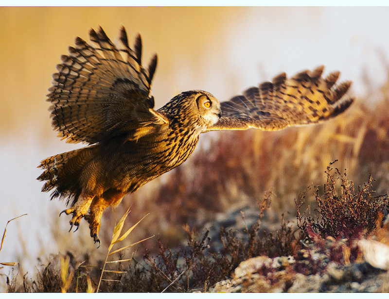

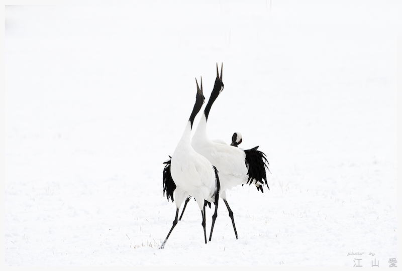

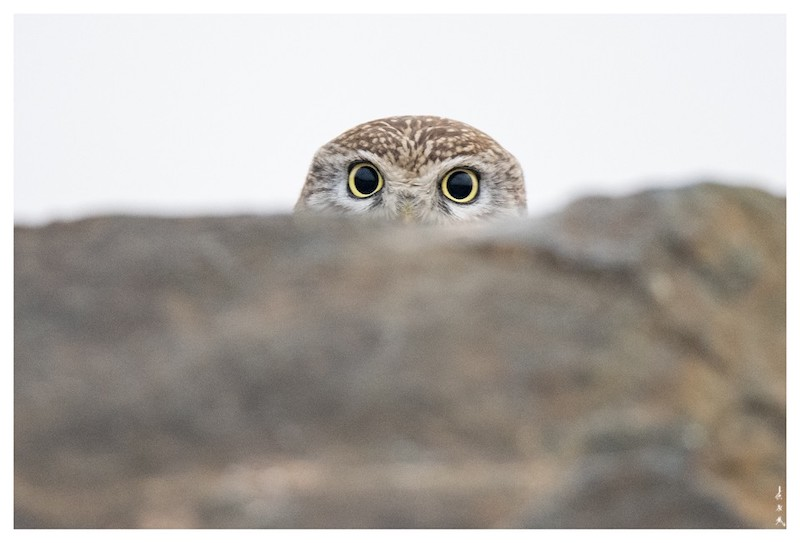

<hr>

## 사진에 담긴 아버지의 삶

환갑 파티를 석달 정도 앞두고 슬슬 고민이 깊어졌다. 무슨 선물을 드려야 좋을까. 카메라나 등산 장비는 더이상 의미가 없었다. 가벼운 가족 캠핑에서도 풀세팅을 포기하지 않는 아버지는 당신이 원하는 모든 장비를 이미 갖추셨다. 그렇다고 소모성 물품을 선물하기엔 환갑의 격에 맞지 않았다.

힌트를 얻으려 카톡방에 공유된 사진을 돌려보던 중 문득 이런 생각이 스쳤다. 렌즈 초점을 맞추고 셔터를 누를 때 아버지는 무슨 생각을 했을까. 무거운 장비를 메고 산에 오르느라 쌓인 피로, 사진 동료들과 함께 비박을 하며 나눈 우애, 기다림 끝에 멋진 작품을 얻으며 느끼는 희열. "오 우리 아빠 사진 멋지네~"라며 우리가 넘기는 사진에서 아버지는 RGB 채널 뒤에 숨겨진 경험과 추억의 채널을 들여다보는게 아닐까.

그런 의미에서 아버지의 환갑 선물은 포토 모자이크(Photo Mosaic)로 결정했다. 아버지가 찍은 사진을 모아 아버지의 형상을 이루는 것. 그것이 지난 인생을 돌아보고 축하하는 환갑의 선물에 걸맞다는 확신이 들었다.

<hr>

## 데이터 모으기

포토 모자이크는 다수의 작은 이미지를 타일 형태 등으로 배치하여 대상 이미지와 유사하게 보이도록 하는 기법이다. 적당한 사진을 선정하기 위해 가짜 프로젝트를 하나 시작했다.

SNS를 하지 않는 아버지께 인스타 계정을 대신 만들어 운영해 드린다고 했다. 처음에는 내키지 않으시는 듯 하더니 곧 프로필로 쓸 사진을 몇 장 보내셨다(ㅋㅋ). 그리고는 당신이 엄선한 사진들을 아침마다 몇 장씩 보내주셨다. 이 과정을 통해 타일로 사용할 이미지들을 400 여장 정도 확보했다. 장강에서 조조의 화살을 갈취한 제갈량의 수법에 필적하는 작전이었다.

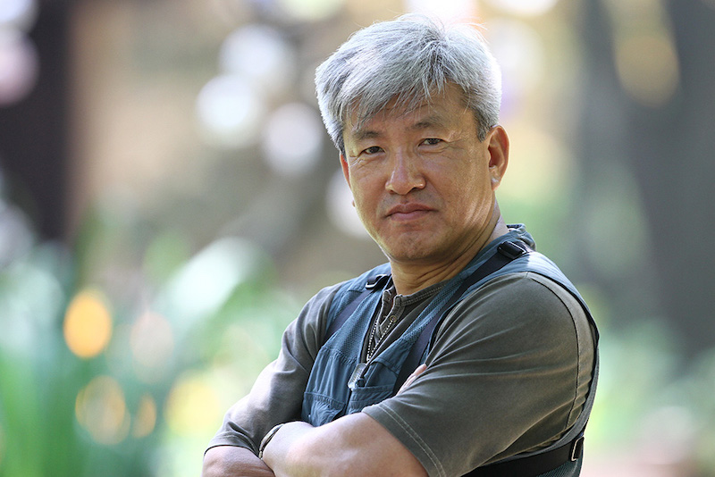

사진: 아버지의 프사

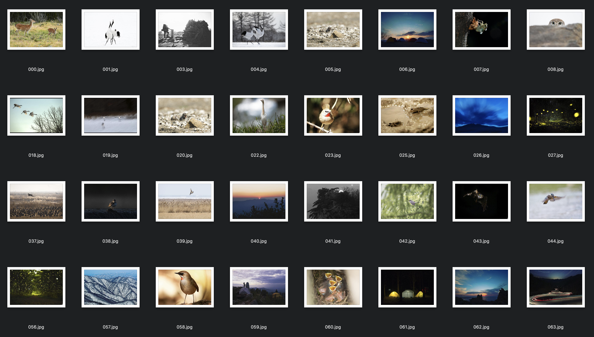

사진: 인스타 계정용으로 받은 재료 사진들

<hr>

## 포토 모자이크

포토 모자이크 알고리즘의 핵심은 대상 이미지의 일부와 타일 이미지를 매칭하는 것이다. 어떤 방식으로 매칭을 하느냐에 따라 포토 모자이크 구현 방법이 달라진다. 내가 참조한 방법은 [Cody Glickman의 포토 모자이크](https://towardsdatascience.com/creating-photo-mosaics-using-python-49100e87efc)[(github)](https://github.com/Datadolittle/Photo_Mosaic)다.

여기서는 대상 이미지를 사각형 타일로 쪼갠 다음, 각 대상 타일을 그 평균 RGB 값으로 압축한다. 마찬가지로 재료가 되는 타일 이미지들의 평균 RGB 값을 구한다.

```python
def getAverageRGB(image):
    im = np.array(image)
    w, h, d = im.shape
    return (tuple(np.average(im.reshape(w * h, d), axis=0)))
```

그리고나서 대상 타일의 벡터와 L2 거리가 가장 짧은 재료 타일을 찾는다.

```python
def getBestMatchIndex(input_avg, avgs):
    avg = input_avg
    index = 0
    min_index = 0
    min_dist = float("inf")
    for val in avgs:
        # L2 distance
        dist = ((val[0] - avg[0]) * (val[0] - avg[0]) +
                (val[1] - avg[1]) * (val[1] - avg[1]) +
                (val[2] - avg[2]) * (val[2] - avg[2]))
        if dist < min_dist:
            min_dist = dist
            min_index = index
        index += 1
    return (min_index)
```

찾아낸 최적의 타일 이미지들을 배치하면 아래와 같은 포토 모자이크를 얻을 수 있다.

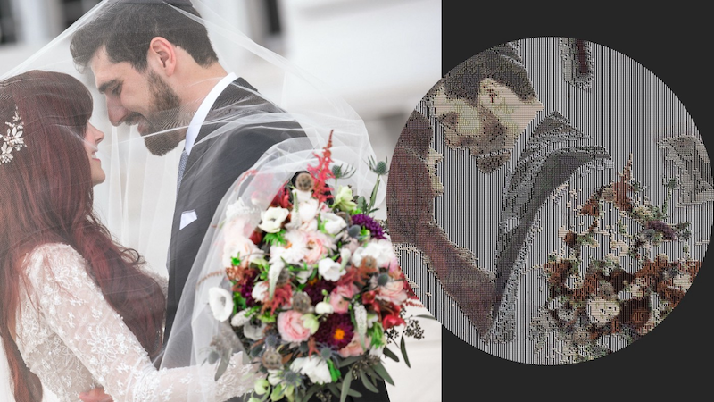

출처: https://towardsdatascience.com/creating-photo-mosaics-using-python-49100e87efc

Glickman의 코드를 사용해서 아버지의 포토 모자이크를 만들어 보았다.


꽤 그럴 듯해 보이는 결과가 나왔다. 그러나 몇가지 아쉬운 점이 보인다. 코드를 살짝 수정해보자.

<hr>

### 개선 1) 자연스러운 타일 배치

Glickman의 타일 매칭 방식은 전체 타일 중 대상 타일과 L2 거리가 가장 작은 1개 타일을 반환한다. 그렇기 때문에 같은 타일이 중복되어 선택되는 경향이 두드러지게 보인다.

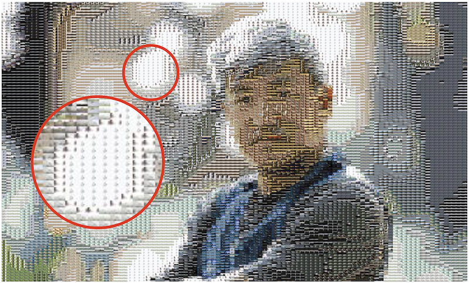

특정 이미지만 반복 선택되는 경향을 피하기 위해서 다음과 같은 로직을 추가한다.

```python
def getBestMatchIndex(input_avg, avgs, random_pool=100):
    avg = input_avg
    index = 0
    min_index = 0
    min_dist = float("inf")

    # adds a bit of randomness
    idx = np.random.choice(np.arange(len(avgs)), random_pool)
    
    for index in idx:
        val = avgs[index]
        dist = ((val[0] - avg[0]) * (val[0] - avg[0]) +
                (val[1] - avg[1]) * (val[1] - avg[1]) +
                (val[2] - avg[2]) * (val[2] - avg[2]))

        if dist < min_dist:
            min_dist = dist
            min_index = index
    
    return min_index
```

전체 재료 타일에서 무작위로 100개를 추출한 다음, 그 안에서 L2 거리가 가장 짧은 타일을 찾도록 하면 다음과 같이 조금 더 자연스러운 결과를 얻을 수 있다.


<hr>

### 개선 2) 이스터 에그

두번째는 약간의 게임 요소다. 모자이크로 만들어진 이미지는 조금 심심해 보인다. 옆에서 구경하던 와이프가 훈수를 둔다. 가족 사진을 몇 장 넣어서 찾아보게끔 해보자고.  설산과 백로도 멋지지만 가족 사진은 또 다른 차원의 의미를 더한다.


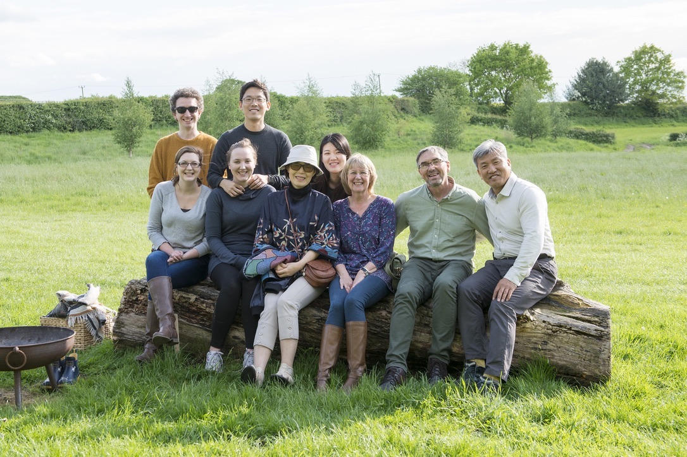


아래는 포토 모자이크를 만들어내는 메인 함수다. 대상 타일에 적합한 재료 타일을 찾는 루프를 돌 때 이스터 에그 사진을 무작위로 집어넣도록 코드를 수정했다.

```python
def createPhotomosaic(target_image, input_images, grid_size,
                      reuse_images, eggs_images):
    ...
    # insert easter eggs
    eggs = len(eggs_images)
    egg_indices = np.random.choice(len(target_images), eggs)
    egg_count = 0
    for idx, img in enumerate(target_images):
        avg = getAverageRGB(img)
        match_index = getBestMatchIndex(avg, avgs)
        if idx in egg_indices:
        	output_images.append(eggs_images[egg_count])
        	egg_count += 1
        else:
        	output_images.append(input_images[match_index])
    ...
```

그리고 가로 세로 타일의 개수를 77개로 설정해 총 타일 개수가 5,929개가 되도록 했다. 백의 자리에서 반올림하면 총 6,000장이 되어 환갑을 의미하도록.

이로서 완성된 사진은 다음과 같다.

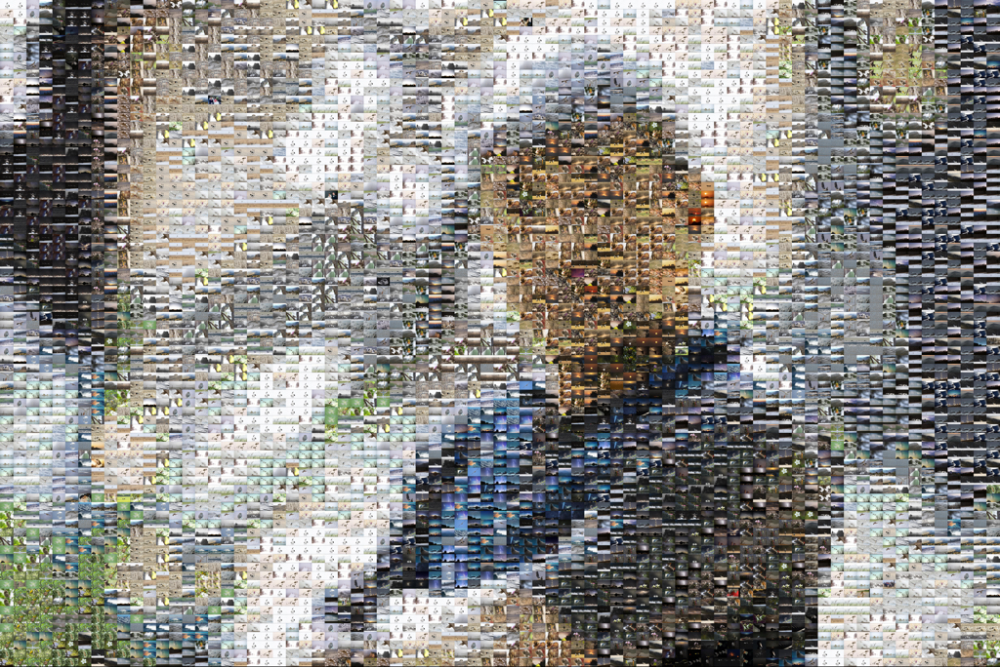

<hr>

## 멋진 액자로 출력

다음은 이미지 파일을 멋진 액자로 출력할 차례다. 전에 사진전을 갔을 때 프레임 없는 멋진 유광 액자를 본 적이 있었다. "아크릴 유광 액자"로 검색해보니 찍스([zzixx.com](http://zzixx.com))라는 업체 사이트가 나왔다.  프레임리스 아크릴 액자가 멋져 보였다. 가까이 갔을 때 재료 타일이 잘 보이도록 A1 사이즈를 선택했다.

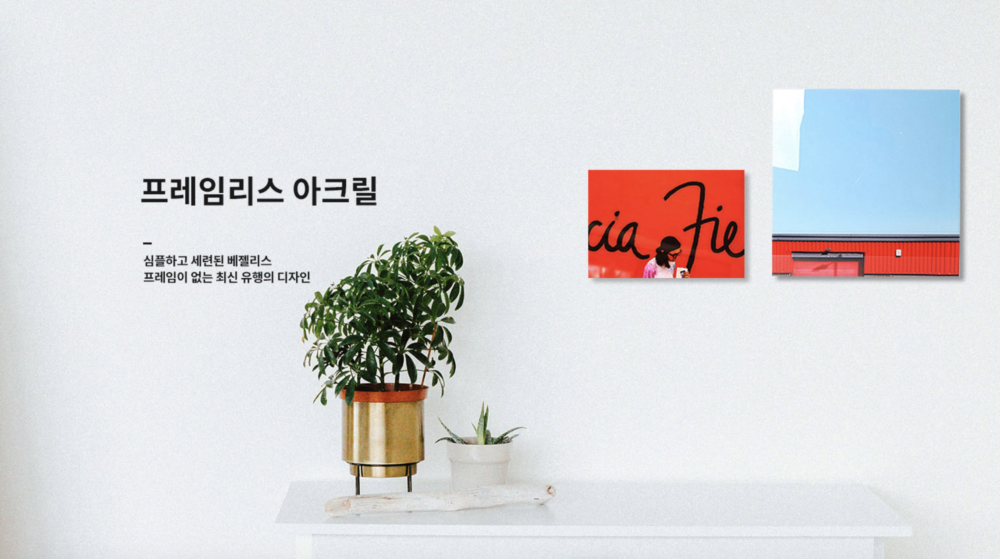

<hr>

## 환갑 선물 공개!

2020년 7월 25일 모처에서 가까운 가족들이 아버지의 환갑을 축하하기 위해 모였다. 식사를 마치고 케익을 자른 후 선물 공개의 시간이 왔다. 동생이 안대를 깜빡한 덕택에 여분의 마스크를 사용해 아버지의 눈을 가린다.

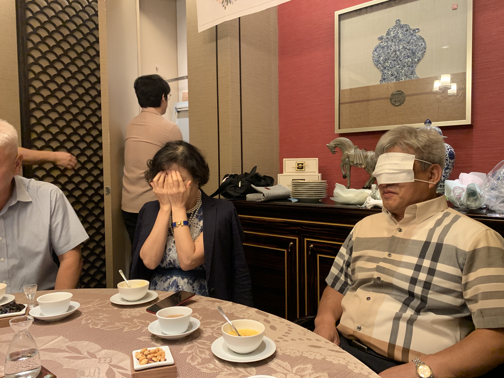

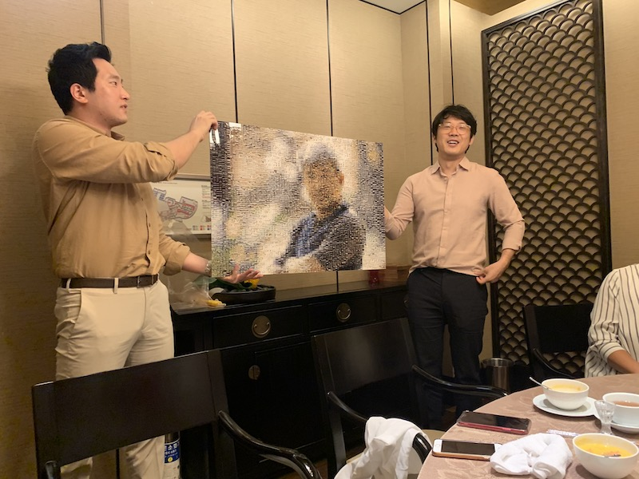

안대를 벗어주세요!


안방과 작은 방 사이 벽에 걸었더니 현관을 열자마자 포토 모자이크 사진이 보인다. 먼 발치에서 보면 아버지 얼굴이 또렷하게 보인다.


<hr>

## Outro

액자 선물이 마음에 드셨는지 아버지는 집에 돌아온 후에도 한참이나 사진을 들여다 보셨다. 무슨 생각을 하셨을까? 아버지가 찍은 사진들을 보며 내가 그 당시 아버지의 마음을 생각했듯이, 아버지도 포토 모자이크를 만드는 내 마음을 생각하셨을 것 같다. 육십 갑자가 돌아 환갑을 이루듯, 마음과 마음이 고리를 만들었다.

<hr>

## Reference

- [Creating Photo Mosaics Using Python](https://towardsdatascience.com/creating-photo-mosaics-using-python-49100e87efc)
- https://github.com/Datadolittle/Photo_Mosaic

